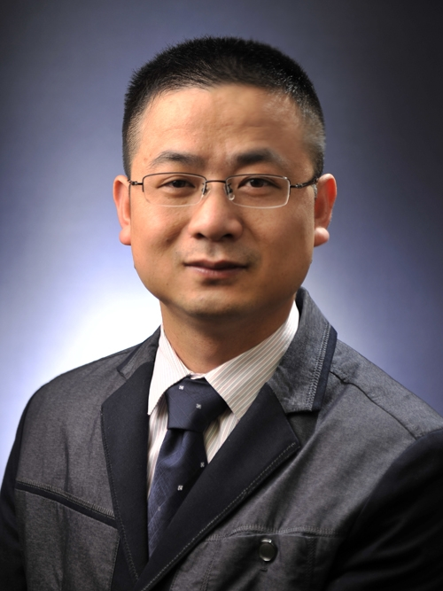

<!-- AUTO-GENERATED-BY: work/generate_obsidian_profiles.py -->

<!-- TEMPLATE: D:\workspace\信息收集整理\医生画像仓库\模板\医生画像模板.md -->

# 李新华

## 基础信息

| 字段 | 内容 |
|---|---|
| 姓名 | 李新华 |
| 医院 | 中山大学附属第三医院 |
| 科室 | 感染性疾病科 |
| 职称/身份 | 主任医师 导师资格 硕士生导师 |
| 来源链接 | [官网原文](https://www.zssy.com.cn/node/11071) |
| 采集日期 | 2026-08-10 |

## 简介/擅长

一直从事各种传染性疾病的临床诊治工作，专研遗传代谢性肝病及各种不明原因肝病。擅长诊治各种肝病，如肝豆状核变性、病毒性肝炎、自身免疫性肝病、肝硬化、肝衰竭及胆汁淤积性肝病等。

## 可包装亮点

- 主任医师 导师资格 硕士生导师 中华医学会肝病分会第二届青年委员会委员，中华医学会肝病分会第一届遗传代谢性肝病协作组委员，亚太医学生物免疫学会委员/肝脏病学分会委员，广东省预防医学会感染病分会专业委员会委员。
- 主持及参与国家级课题多项，先后在国际顶级肝病杂志Journal of hepatology、journal of infectious diseases及其他杂志上发表论文40余篇（其中第一作者或通讯作者SCI文章9篇）。

## 重点疾病/人群标签

- 慢性病：代谢、免疫、感染
- 肿瘤：
- 生殖疾病：
- 免疫/风湿：代谢、免疫、感染
- 术后恢复/康复：
- 疑难重症：

## 证据摘录

> 只摘录官网公开信息中的短句或关键字段，不复制大段原文。

- 官网身份字段：主任医师 导师资格 硕士生导师
- 官网简介/擅长：一直从事各种传染性疾病的临床诊治工作，专研遗传代谢性肝病及各种不明原因肝病。擅长诊治各种肝病，如肝豆状核变性、病毒性肝炎、自身免疫性肝病、肝硬化、肝衰竭及胆汁淤积性肝病等。
- 官网亮眼经历线索：主任医师 导师资格 硕士生导师 中华医学会肝病分会第二届青年委员会委员，中华医学会肝病分会第一届遗传代谢性肝病协作组委员，亚太医学生物免疫学会委员/肝脏病学分会委员，广东省预防医学会感染病分会专业委员会委员。 主持及参与国家级课题多项，先后在国际顶级肝病杂志Journal of hepatology、journal of infectious diseases及其他杂志上发表论文40余篇（其中第一作者或通讯作者SCI文章9篇）。
- 来源链接：https://www.zssy.com.cn/node/11071

## BD 画像摘要

李新华医生可作为慢性病、免疫/风湿/感染方向的基础画像候选。后续 BD 使用应继续以官网来源和人工复核为准，不添加疗效承诺或无来源包装。

## 合规边界

- 仅使用医院官网、官方公众号、官方小程序等公开渠道。
- 不采集私人电话、私人微信、家庭住址、患者隐私或非公开排班信息。
- 不写“保证治愈”“疗效第一”“包治疑难杂症”等无法由官网证明的表述。
