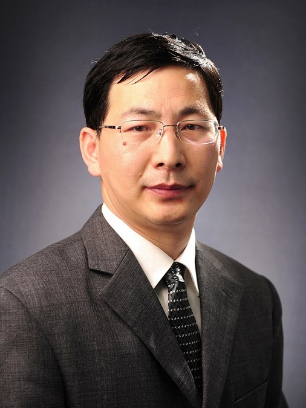

<!-- AUTO-GENERATED-BY: work/generate_obsidian_profiles.py -->

<!-- TEMPLATE: D:\workspace\信息收集整理\医生画像仓库\模板\医生画像模板.md -->

# 李永奇

## 基础信息

| 字段 | 内容 |
|---|---|
| 姓名 | 李永奇 |
| 医院 | 中山大学附属第三医院 |
| 科室 | 耳鼻咽喉科 |
| 职称/身份 | 主任医师 导师资格 硕士生导师 |
| 来源链接 | [官网原文](https://www.zssy.com.cn/node/14203) |
| 采集日期 | 2026-08-10 |

## 简介/擅长

擅长耳科学疾病的诊断与治疗，精通耳显微外科和耳神经外科手术，如各型鼓室成形术、人工听骨听力重建术、镫骨底板开窗小孔人工镫骨植入术、电子耳蜗植入术、面神经减压术、外耳道成形术、耳周及颞骨肿瘤切除术等。对中耳炎、外中耳畸形、耳聋、眩晕、耳鸣、耳硬化症、咽鼓管功能障碍、周围性面瘫及颞骨肿瘤等的诊断和治疗有丰富的临床经验。

## 可包装亮点

- 主任医师 导师资格 硕士生导师 导航痕迹 首页 / 专家介绍 / 李永奇 李永奇 科室 耳鼻咽喉科 职称 主任医师 导师资格 硕士生导师 擅长 擅长耳科学疾病的诊断与治疗，精通耳显微外科和耳神经外科手术，如各型鼓室成形术、人工听骨听力重建术、镫骨底板开窗小孔人工镫骨植入术、电子耳蜗植入术、面神经减压术、外耳道成形术、耳周及颞骨肿瘤切除术等。

## 重点疾病/人群标签

- 慢性病：
- 肿瘤：肿瘤、功能障碍
- 生殖疾病：
- 免疫/风湿：
- 术后恢复/康复：肿瘤、功能障碍
- 疑难重症：

## 证据摘录

> 只摘录官网公开信息中的短句或关键字段，不复制大段原文。

- 官网身份字段：主任医师 导师资格 硕士生导师
- 官网简介/擅长：擅长耳科学疾病的诊断与治疗，精通耳显微外科和耳神经外科手术，如各型鼓室成形术、人工听骨听力重建术、镫骨底板开窗小孔人工镫骨植入术、电子耳蜗植入术、面神经减压术、外耳道成形术、耳周及颞骨肿瘤切除术等。对中耳炎、外中耳畸形、耳聋、眩晕、耳鸣、耳硬化症、咽鼓管功能障碍、周围性面瘫及颞骨肿瘤等的诊断和治疗有丰富的临床经验。
- 官网亮眼经历线索：主任医师 导师资格 硕士生导师 导航痕迹 首页 / 专家介绍 / 李永奇 李永奇 科室 耳鼻咽喉科 职称 主任医师 导师资格 硕士生导师 擅长 擅长耳科学疾病的诊断与治疗，精通耳显微外科和耳神经外科手术，如各型鼓室成形术、人工听骨听力重建术、镫骨底板开窗小孔人工镫骨植入术、电子耳蜗植入术、面神经减压术、外耳道成形术、耳周及颞骨肿瘤切除术等。
- 来源链接：https://www.zssy.com.cn/node/14203

## BD 画像摘要

李永奇医生可作为肿瘤、术后恢复/康复方向的基础画像候选。后续 BD 使用应继续以官网来源和人工复核为准，不添加疗效承诺或无来源包装。

## 合规边界

- 仅使用医院官网、官方公众号、官方小程序等公开渠道。
- 不采集私人电话、私人微信、家庭住址、患者隐私或非公开排班信息。
- 不写“保证治愈”“疗效第一”“包治疑难杂症”等无法由官网证明的表述。
