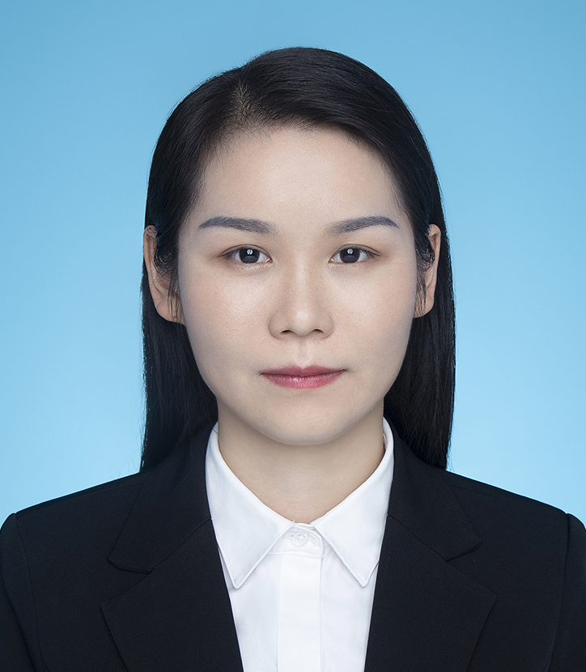

<!-- AUTO-GENERATED-BY: work/generate_obsidian_profiles.py -->

<!-- TEMPLATE: D:\workspace\信息收集整理\医生画像仓库\模板\医生画像模板.md -->

# 李海凤

## 基础信息

| 字段 | 内容 |
|---|---|
| 姓名 | 李海凤 |
| 医院 | 中山大学附属第三医院 |
| 科室 | 病理科 |
| 职称/身份 | 主治医师 |
| 来源链接 | [官网原文](https://www.zssy.com.cn/node/20652) |
| 采集日期 | 2026-08-10 |

## 简介/擅长

专注细胞病理亚专科及淋巴造血系统疾病亚专科的临床诊断工作

## 可包装亮点

- 专注细胞病理亚专科及淋巴造血系统疾病亚专科的临床诊断工作

## 重点疾病/人群标签

- 慢性病：
- 肿瘤：
- 生殖疾病：
- 免疫/风湿：
- 术后恢复/康复：
- 疑难重症：

## 证据摘录

> 只摘录官网公开信息中的短句或关键字段，不复制大段原文。

- 官网身份字段：主治医师
- 官网简介/擅长：专注细胞病理亚专科及淋巴造血系统疾病亚专科的临床诊断工作
- 来源链接：https://www.zssy.com.cn/node/20652

## BD 画像摘要

李海凤医生可作为中山大学附属第三医院病理科的基础医生资料入库。当前重点方向以总底表标签为准，官网未展示的信息保持空白。

## 合规边界

- 仅使用医院官网、官方公众号、官方小程序等公开渠道。
- 不采集私人电话、私人微信、家庭住址、患者隐私或非公开排班信息。
- 不写“保证治愈”“疗效第一”“包治疑难杂症”等无法由官网证明的表述。
