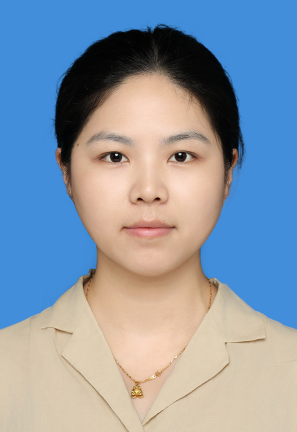

<!-- AUTO-GENERATED-BY: work/generate_obsidian_profiles.py -->

<!-- TEMPLATE: D:\workspace\信息收集整理\医生画像仓库\模板\医生画像模板.md -->

# 李烨

## 基础信息

| 字段 | 内容 |
|---|---|
| 姓名 | 李烨 |
| 医院 | 中山大学附属第三医院 |
| 科室 | 药剂科 |
| 职称/身份 | 副主任药师 |
| 来源链接 | [官网原文](https://www.zssy.com.cn/node/29790) |
| 采集日期 | 2026-08-10 |

## 简介/擅长

主研免疫系统药物临床药学服务，致力于优化药物治疗，提升患者治疗效果。主要工作包括药物重整、用药管理以及药物咨询与教育，涵盖疗效评估、药物相互作用分析和用药安全指导。根据患者个体情况，提供个性化的用药建议，旨在提高治疗效果并减少副作用。同时，提供妊娠及哺乳期妇女的合理用药咨询服务，确保药物使用的安全性与有效性。

## 可包装亮点

- 广东省药学会儿童血液肿瘤专家委员会副主任委员；
- 广东省精准医学应用学会精准用药分会委员；
- 广东省药学会第一届医药科研与应用专家委员会委员；
- 广东省药学会第一届免疫抑制药学专家委员会常委。

## 重点疾病/人群标签

- 慢性病：
- 肿瘤：肿瘤、免疫
- 生殖疾病：
- 免疫/风湿：肿瘤、免疫
- 术后恢复/康复：
- 疑难重症：

## 证据摘录

> 只摘录官网公开信息中的短句或关键字段，不复制大段原文。

- 官网身份字段：副主任药师
- 官网简介/擅长：主研免疫系统药物临床药学服务，致力于优化药物治疗，提升患者治疗效果。主要工作包括药物重整、用药管理以及药物咨询与教育，涵盖疗效评估、药物相互作用分析和用药安全指导。根据患者个体情况，提供个性化的用药建议，旨在提高治疗效果并减少副作用。同时，提供妊娠及哺乳期妇女的合理用药咨询服务，确保药物使用的安全性与有效性。
- 官网亮眼经历线索：广东省药学会儿童血液肿瘤专家委员会副主任委员； 广东省精准医学应用学会精准用药分会委员； 广东省药学会第一届医药科研与应用专家委员会委员； 广东省药学会第一届免疫抑制药学专家委员会常委。
- 来源链接：https://www.zssy.com.cn/node/29790

## BD 画像摘要

李烨医生可作为肿瘤、免疫/风湿/感染方向的基础画像候选。后续 BD 使用应继续以官网来源和人工复核为准，不添加疗效承诺或无来源包装。

## 合规边界

- 仅使用医院官网、官方公众号、官方小程序等公开渠道。
- 不采集私人电话、私人微信、家庭住址、患者隐私或非公开排班信息。
- 不写“保证治愈”“疗效第一”“包治疑难杂症”等无法由官网证明的表述。
