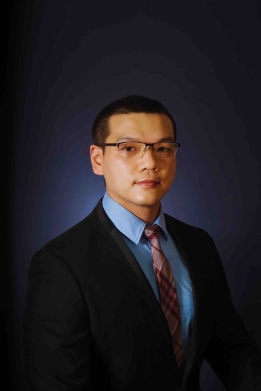

<!-- AUTO-GENERATED-BY: work/generate_obsidian_profiles.py -->

<!-- TEMPLATE: D:\workspace\信息收集整理\医生画像仓库\模板\医生画像模板.md -->

# 李科

## 基础信息

| 字段 | 内容 |
|---|---|
| 姓名 | 李科 |
| 医院 | 中山大学附属第三医院 |
| 科室 | 泌尿外科 |
| 职称/身份 | 主任医师 导师资格 博士生导师 |
| 来源链接 | [官网原文](https://www.zssy.com.cn/node/15452) |
| 采集日期 | 2026-08-10 |

## 简介/擅长

长期从事泌尿外科临床诊疗工作，擅长前列腺增生、泌尿系肿瘤、结石等机器人、腹腔镜微创手术治疗，尤其在前列腺增生和泌尿系肿瘤领域有着深入钻研；致力于泌尿系疾病“超微创”治疗和加速外科术后康复，以及泌尿系肿瘤全程化管理、规范肿瘤诊疗流程；多次获邀进行全国手术直播和教学。

## 可包装亮点

- 主任医师 导师资格 博士生导师 获选广州市“珠江科技新星”创新人才，中山大学附属第三医院杰出青年后备人才；
- 现任中华医学会泌尿外科分会转化学组青年委员，中国中西医结合学会泌尿外科专委会青年委员，广东省医院协会机器人和智能装备委员会副主任委员，广东省医学会及医师协会泌尿外分会青年委员，广东省医学会男科学分会前列腺学组副组长，《中华腔镜泌尿外科杂志（电子版）》总编助理。

## 重点疾病/人群标签

- 慢性病：
- 肿瘤：肿瘤、术后、康复
- 生殖疾病：
- 免疫/风湿：
- 术后恢复/康复：肿瘤、术后、康复
- 疑难重症：

## 证据摘录

> 只摘录官网公开信息中的短句或关键字段，不复制大段原文。

- 官网身份字段：主任医师 导师资格 博士生导师
- 官网简介/擅长：长期从事泌尿外科临床诊疗工作，擅长前列腺增生、泌尿系肿瘤、结石等机器人、腹腔镜微创手术治疗，尤其在前列腺增生和泌尿系肿瘤领域有着深入钻研；致力于泌尿系疾病“超微创”治疗和加速外科术后康复，以及泌尿系肿瘤全程化管理、规范肿瘤诊疗流程；多次获邀进行全国手术直播和教学。
- 官网亮眼经历线索：主任医师 导师资格 博士生导师 获选广州市“珠江科技新星”创新人才，中山大学附属第三医院杰出青年后备人才； 现任中华医学会泌尿外科分会转化学组青年委员，中国中西医结合学会泌尿外科专委会青年委员，广东省医院协会机器人和智能装备委员会副主任委员，广东省医学会及医师协会泌尿外分会青年委员，广东省医学会男科学分会前列腺学组副组长，《中华腔镜泌尿外科杂志（电子版）》总编助理。
- 来源链接：https://www.zssy.com.cn/node/15452

## BD 画像摘要

李科医生可作为肿瘤、术后恢复/康复方向的基础画像候选。后续 BD 使用应继续以官网来源和人工复核为准，不添加疗效承诺或无来源包装。

## 合规边界

- 仅使用医院官网、官方公众号、官方小程序等公开渠道。
- 不采集私人电话、私人微信、家庭住址、患者隐私或非公开排班信息。
- 不写“保证治愈”“疗效第一”“包治疑难杂症”等无法由官网证明的表述。
