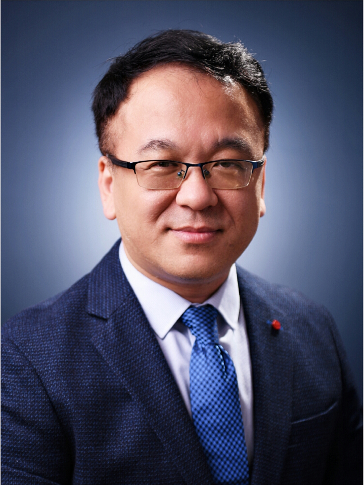

<!-- AUTO-GENERATED-BY: work/generate_obsidian_profiles.py -->

<!-- TEMPLATE: D:\workspace\信息收集整理\医生画像仓库\模板\医生画像模板.md -->

# 李鹏

## 基础信息

| 字段 | 内容 |
|---|---|
| 姓名 | 李鹏 |
| 医院 | 中山大学附属第三医院 |
| 科室 | 耳鼻咽喉科 |
| 职称/身份 | 主任医师 导师资格 博士生导师 |
| 来源链接 | [官网原文](https://www.zssy.com.cn/node/14204) |
| 采集日期 | 2026-08-10 |

## 简介/擅长

中耳炎、听骨链畸形、耳硬化症、咽鼓管功能障碍、先天性耳廓畸形、听力障碍。人工耳蜗植入手术，骨桥及骨锚式助听器植入手术，擅长慢性化脓性中耳炎、胆脂瘤型中耳炎、耳硬化、听骨链畸形、听力障碍等疾病的显微镜外科手术和耳内镜微创手术，顽固性眩晕的外科手术，咽鼓管功能障碍微创手术。

## 可包装亮点

- 主任医师 导师资格 博士生导师 耳鼻咽喉头颈外科副主任 耳外科主任 主任医师 医学博士 博士研究生导师

## 重点疾病/人群标签

- 慢性病：慢性、瘤、功能障碍
- 肿瘤：慢性、瘤、功能障碍
- 生殖疾病：
- 免疫/风湿：
- 术后恢复/康复：慢性、瘤、功能障碍
- 疑难重症：

## 证据摘录

> 只摘录官网公开信息中的短句或关键字段，不复制大段原文。

- 官网身份字段：主任医师 导师资格 博士生导师
- 官网简介/擅长：中耳炎、听骨链畸形、耳硬化症、咽鼓管功能障碍、先天性耳廓畸形、听力障碍。人工耳蜗植入手术，骨桥及骨锚式助听器植入手术，擅长慢性化脓性中耳炎、胆脂瘤型中耳炎、耳硬化、听骨链畸形、听力障碍等疾病的显微镜外科手术和耳内镜微创手术，顽固性眩晕的外科手术，咽鼓管功能障碍微创手术。
- 官网亮眼经历线索：主任医师 导师资格 博士生导师 耳鼻咽喉头颈外科副主任 耳外科主任 主任医师 医学博士 博士研究生导师
- 来源链接：https://www.zssy.com.cn/node/14204

## BD 画像摘要

李鹏医生可作为慢性病、肿瘤、术后恢复/康复方向的基础画像候选。后续 BD 使用应继续以官网来源和人工复核为准，不添加疗效承诺或无来源包装。

## 合规边界

- 仅使用医院官网、官方公众号、官方小程序等公开渠道。
- 不采集私人电话、私人微信、家庭住址、患者隐私或非公开排班信息。
- 不写“保证治愈”“疗效第一”“包治疑难杂症”等无法由官网证明的表述。
