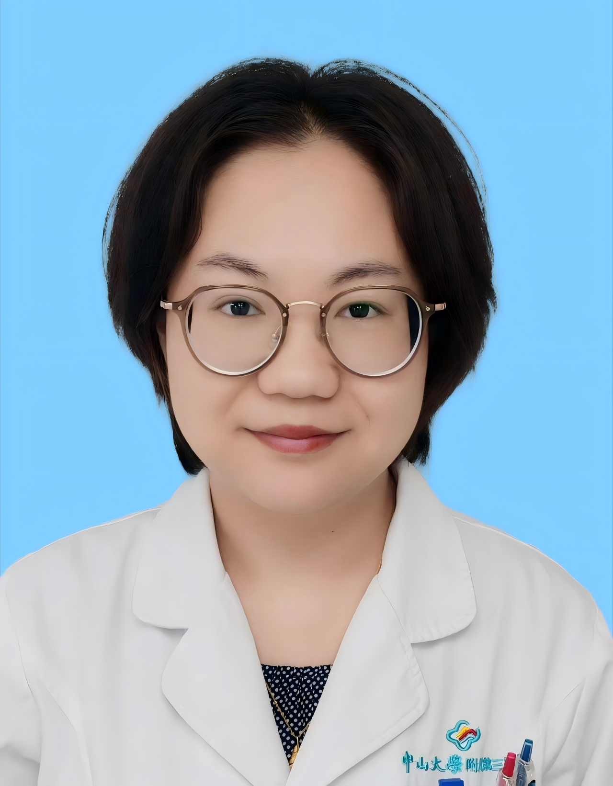

<!-- AUTO-GENERATED-BY: work/generate_obsidian_profiles.py -->

<!-- TEMPLATE: D:\workspace\信息收集整理\医生画像仓库\模板\医生画像模板.md -->

# 杨婷

## 基础信息

| 字段 | 内容 |
|---|---|
| 姓名 | 杨婷 |
| 医院 | 中山大学附属第三医院 |
| 科室 | 核医学科 |
| 职称/身份 | 主治医师 |
| 来源链接 | [官网原文](https://www.zssy.com.cn/node/29795) |
| 采集日期 | 2026-08-10 |

## 简介/擅长

肿瘤的核素靶向治疗及分子影像。

## 可包装亮点

- 杨婷：主治医师，医学硕士，从事核医学科工作7年余，曾担任科室总住院医师3年，担任科室教学秘书3年，以第一作者发表核医学相关论文十余篇。
- 目前在下述学会任职：广东省中西医结合学会实验医学专业委员会，广州市医师协会核医学与分子影像医师分会第二届委员会，广东省精准医学应用学会脑活检技术分会。

## 重点疾病/人群标签

- 慢性病：
- 肿瘤：肿瘤、靶向
- 生殖疾病：
- 免疫/风湿：
- 术后恢复/康复：
- 疑难重症：

## 证据摘录

> 只摘录官网公开信息中的短句或关键字段，不复制大段原文。

- 官网身份字段：主治医师
- 官网简介/擅长：肿瘤的核素靶向治疗及分子影像。
- 官网亮眼经历线索：杨婷：主治医师，医学硕士，从事核医学科工作7年余，曾担任科室总住院医师3年，担任科室教学秘书3年，以第一作者发表核医学相关论文十余篇。 目前在下述学会任职：广东省中西医结合学会实验医学专业委员会，广州市医师协会核医学与分子影像医师分会第二届委员会，广东省精准医学应用学会脑活检技术分会。
- 来源链接：https://www.zssy.com.cn/node/29795

## BD 画像摘要

杨婷医生可作为肿瘤方向的基础画像候选。后续 BD 使用应继续以官网来源和人工复核为准，不添加疗效承诺或无来源包装。

## 合规边界

- 仅使用医院官网、官方公众号、官方小程序等公开渠道。
- 不采集私人电话、私人微信、家庭住址、患者隐私或非公开排班信息。
- 不写“保证治愈”“疗效第一”“包治疑难杂症”等无法由官网证明的表述。
