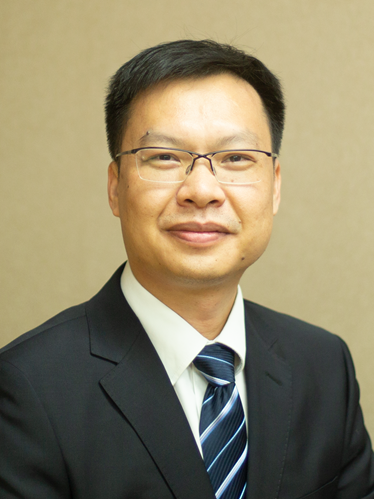

<!-- AUTO-GENERATED-BY: work/generate_obsidian_profiles.py -->

<!-- TEMPLATE: D:\workspace\信息收集整理\医生画像仓库\模板\医生画像模板.md -->

# 杨钦泰

## 基础信息

| 字段 | 内容 |
|---|---|
| 姓名 | 杨钦泰 |
| 医院 | 中山大学附属第三医院 |
| 科室 | 变态反应（过敏）学科 |
| 职称/身份 | 主任医师, 教授 导师资格 博士生导师 |
| 来源链接 | [官网原文](https://www.zssy.com.cn/node/15324) |
| 采集日期 | 2026-08-10 |

## 简介/擅长

鼻科疾病的诊断和治疗，尤其是过敏性鼻炎的诊断和治疗以及鼻-鼻窦疾病、鼻-咽相关疾病、鼻-眼相关疾病、鼻-颅底相关疾病的鼻内镜微创手术治疗。

## 可包装亮点

- 主任医师, 教授 导师资格 博士生导师 变态反应（过敏）科学科负责人 主任医师，医学博士，博士研究生导师，现任中山大学附属第三医院副院长。
- 兼任中华医学会耳鼻咽喉头颈外科学分会青年委员会副主任委员，中华医学会耳鼻咽喉头颈外科分会鼻科组副秘书长；
- 中华医学会变态反应学分会委员；

## 重点疾病/人群标签

- 慢性病：
- 肿瘤：
- 生殖疾病：
- 免疫/风湿：
- 术后恢复/康复：
- 疑难重症：

## 证据摘录

> 只摘录官网公开信息中的短句或关键字段，不复制大段原文。

- 官网身份字段：主任医师, 教授 导师资格 博士生导师
- 官网简介/擅长：鼻科疾病的诊断和治疗，尤其是过敏性鼻炎的诊断和治疗以及鼻-鼻窦疾病、鼻-咽相关疾病、鼻-眼相关疾病、鼻-颅底相关疾病的鼻内镜微创手术治疗。
- 官网亮眼经历线索：主任医师, 教授 导师资格 博士生导师 变态反应（过敏）科学科负责人 主任医师，医学博士，博士研究生导师，现任中山大学附属第三医院副院长。 兼任中华医学会耳鼻咽喉头颈外科学分会青年委员会副主任委员，中华医学会耳鼻咽喉头颈外科分会鼻科组副秘书长； 中华医学会变态反应学分会委员；
- 来源链接：https://www.zssy.com.cn/node/15324

## BD 画像摘要

杨钦泰医生可作为中山大学附属第三医院变态反应（过敏）学科的基础医生资料入库。当前重点方向以总底表标签为准，官网未展示的信息保持空白。

## 合规边界

- 仅使用医院官网、官方公众号、官方小程序等公开渠道。
- 不采集私人电话、私人微信、家庭住址、患者隐私或非公开排班信息。
- 不写“保证治愈”“疗效第一”“包治疑难杂症”等无法由官网证明的表述。
