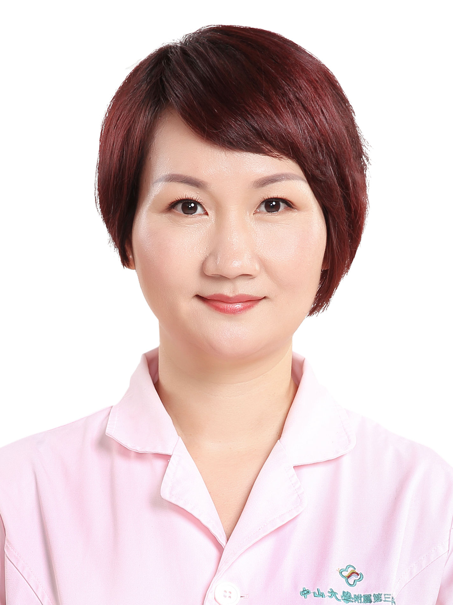

<!-- AUTO-GENERATED-BY: work/generate_obsidian_profiles.py -->

<!-- TEMPLATE: D:\workspace\信息收集整理\医生画像仓库\模板\医生画像模板.md -->

# 林慧

## 基础信息

| 字段 | 内容 |
|---|---|
| 姓名 | 林慧 |
| 医院 | 中山大学附属第三医院 |
| 科室 | 生殖医学中心 |
| 职称/身份 | 副主任护师 |
| 来源链接 | [官网原文](https://www.zssy.com.cn/node/15251) |
| 采集日期 | 2026-08-10 |

## 简介/擅长

不孕不育及性功能障碍的心理辅导及辅助治疗

## 可包装亮点

- 从事辅助生殖技术护理工作十多年，发表论文十多篇，参与多项科研项目。
- 广东省护理学会生殖护理专业委员会常务委员 广东省护士协会第二届理事会生殖健康与生育力保护护士分会常委 广东省人类辅助生殖技术质控中心护理专业组成员 广东省性学会会员 广东省性医学分会委员

## 重点疾病/人群标签

- 慢性病：
- 肿瘤：
- 生殖疾病：生殖、不孕、辅助生殖、功能障碍
- 免疫/风湿：
- 术后恢复/康复：生殖、不孕、辅助生殖、功能障碍
- 疑难重症：

## 证据摘录

> 只摘录官网公开信息中的短句或关键字段，不复制大段原文。

- 官网身份字段：副主任护师
- 官网简介/擅长：不孕不育及性功能障碍的心理辅导及辅助治疗
- 官网亮眼经历线索：从事辅助生殖技术护理工作十多年，发表论文十多篇，参与多项科研项目。 广东省护理学会生殖护理专业委员会常务委员 广东省护士协会第二届理事会生殖健康与生育力保护护士分会常委 广东省人类辅助生殖技术质控中心护理专业组成员 广东省性学会会员 广东省性医学分会委员
- 来源链接：https://www.zssy.com.cn/node/15251

## BD 画像摘要

林慧医生可作为生殖疾病、术后恢复/康复方向的基础画像候选。后续 BD 使用应继续以官网来源和人工复核为准，不添加疗效承诺或无来源包装。

## 合规边界

- 仅使用医院官网、官方公众号、官方小程序等公开渠道。
- 不采集私人电话、私人微信、家庭住址、患者隐私或非公开排班信息。
- 不写“保证治愈”“疗效第一”“包治疑难杂症”等无法由官网证明的表述。
