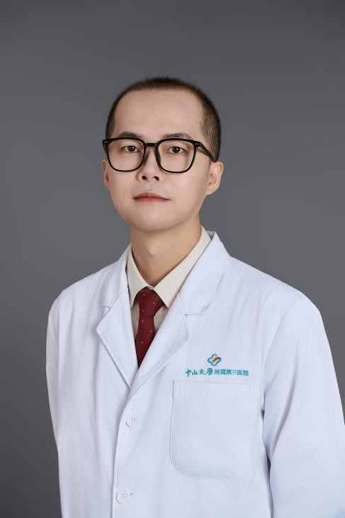

<!-- AUTO-GENERATED-BY: work/generate_obsidian_profiles.py -->

<!-- TEMPLATE: D:\workspace\信息收集整理\医生画像仓库\模板\医生画像模板.md -->

# 林泽晓

## 基础信息

| 字段 | 内容 |
|---|---|
| 姓名 | 林泽晓 |
| 医院 | 中山大学附属第三医院 |
| 科室 | 肿瘤内科 |
| 职称/身份 | 副主任医师 导师资格 硕士生导师 |
| 来源链接 | [官网原文](https://www.zssy.com.cn/node/29892) |
| 采集日期 | 2026-08-10 |

## 简介/擅长

从事肿瘤内科临床、教学和科研工作10余年，擅长各种常见恶性肿瘤的化疗、靶向治疗及免疫治疗，主要研究方向是肝胆道肿瘤（包括肝癌、胆管癌和肝脏转移瘤）和淋巴血液系统肿瘤（包括非霍奇金淋巴瘤、霍奇金淋巴瘤）的个体化内科治疗。

## 可包装亮点

- 副主任医师 导师资格 硕士生导师 副主任医师，医学博士，硕士研究生导师。
- 广东省基层医药学会消化肿瘤防治专委会常务委员；
- 广东省抗癌协会肿瘤内科学专业委员会委员；

## 重点疾病/人群标签

- 慢性病：
- 肿瘤：肿瘤、癌、瘤、淋巴瘤、化疗、靶向、肝癌、免疫、多学科
- 生殖疾病：
- 免疫/风湿：肿瘤、癌、瘤、淋巴瘤、化疗、靶向、肝癌、免疫、多学科
- 术后恢复/康复：
- 疑难重症：肿瘤、癌、瘤、淋巴瘤、化疗、靶向、肝癌、免疫、多学科

## 证据摘录

> 只摘录官网公开信息中的短句或关键字段，不复制大段原文。

- 官网身份字段：副主任医师 导师资格 硕士生导师
- 官网简介/擅长：从事肿瘤内科临床、教学和科研工作10余年，擅长各种常见恶性肿瘤的化疗、靶向治疗及免疫治疗，主要研究方向是肝胆道肿瘤（包括肝癌、胆管癌和肝脏转移瘤）和淋巴血液系统肿瘤（包括非霍奇金淋巴瘤、霍奇金淋巴瘤）的个体化内科治疗。
- 官网亮眼经历线索：副主任医师 导师资格 硕士生导师 副主任医师，医学博士，硕士研究生导师。 广东省基层医药学会消化肿瘤防治专委会常务委员； 广东省抗癌协会肿瘤内科学专业委员会委员；
- 来源链接：https://www.zssy.com.cn/node/29892

## BD 画像摘要

林泽晓医生可作为肿瘤、免疫/风湿/感染、疑难重症方向的基础画像候选。后续 BD 使用应继续以官网来源和人工复核为准，不添加疗效承诺或无来源包装。

## 合规边界

- 仅使用医院官网、官方公众号、官方小程序等公开渠道。
- 不采集私人电话、私人微信、家庭住址、患者隐私或非公开排班信息。
- 不写“保证治愈”“疗效第一”“包治疑难杂症”等无法由官网证明的表述。
