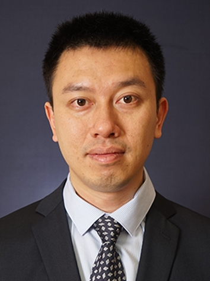

<!-- AUTO-GENERATED-BY: work/generate_obsidian_profiles.py -->

<!-- TEMPLATE: D:\workspace\信息收集整理\医生画像仓库\模板\医生画像模板.md -->

# 林硕

## 基础信息

| 字段 | 内容 |
|---|---|
| 姓名 | 林硕 |
| 医院 | 中山大学附属第三医院 |
| 科室 | 内分泌与代谢病学科 |
| 职称/身份 | 主任医师 导师资格 硕士生导师 |
| 来源链接 | [官网原文](https://www.zssy.com.cn/node/14125) |
| 采集日期 | 2026-08-10 |

## 简介/擅长

糖尿病及其并发症、甲亢的诊治 学术成果：主持及参与多项省部级科研项目。已发表论文50余篇，其 中第一/共一/通讯作者高质量论文10余篇。 荣誉称号：2022年广东实力中青年医生

## 可包装亮点

- 主任医师 导师资格 硕士生导师 已发表论文50余篇，其 中第一/共一/通讯作者高质量论文10余篇。
- 中山大学附属第三医院内分泌科 甲状腺疾病专科主任 肇庆医院内分泌与代谢病学科主任 学术任职： 广东省医学会内分泌学分会委员（兼秘书） 广东省保健协会糖尿病分会副主任委员 广东省器官医学与技术学会甲状腺多学科诊疗专业委员会副主任委员 广东省医疗行业协会内分泌代谢科管理分会常委 研究方向：糖尿病及其并发症、甲亢的诊治 学术成果：主持及参与多项省部级科研项目。
- 已发表论文50余篇，其 中第一/共一/通讯作者高质量论文10余篇。

## 重点疾病/人群标签

- 慢性病：糖尿病、代谢、多学科
- 肿瘤：
- 生殖疾病：
- 免疫/风湿：
- 术后恢复/康复：
- 疑难重症：糖尿病、代谢、多学科

## 证据摘录

> 只摘录官网公开信息中的短句或关键字段，不复制大段原文。

- 官网身份字段：主任医师 导师资格 硕士生导师
- 官网简介/擅长：糖尿病及其并发症、甲亢的诊治 学术成果：主持及参与多项省部级科研项目。已发表论文50余篇，其 中第一/共一/通讯作者高质量论文10余篇。 荣誉称号：2022年广东实力中青年医生
- 官网亮眼经历线索：主任医师 导师资格 硕士生导师 已发表论文50余篇，其 中第一/共一/通讯作者高质量论文10余篇。 中山大学附属第三医院内分泌科 甲状腺疾病专科主任 肇庆医院内分泌与代谢病学科主任 学术任职： 广东省医学会内分泌学分会委员（兼秘书） 广东省保健协会糖尿病分会副主任委员 广东省器官医学与技术学会甲状腺多学科诊疗专业委员会副主任委员 广东省医疗行业协会内分泌代谢科管理分会常委 研究方向：糖尿病及其并发症、甲亢的诊治 学术成果：主持及参与多…
- 来源链接：https://www.zssy.com.cn/node/14125

## BD 画像摘要

林硕医生可作为慢性病、疑难重症方向的基础画像候选。后续 BD 使用应继续以官网来源和人工复核为准，不添加疗效承诺或无来源包装。

## 合规边界

- 仅使用医院官网、官方公众号、官方小程序等公开渠道。
- 不采集私人电话、私人微信、家庭住址、患者隐私或非公开排班信息。
- 不写“保证治愈”“疗效第一”“包治疑难杂症”等无法由官网证明的表述。
