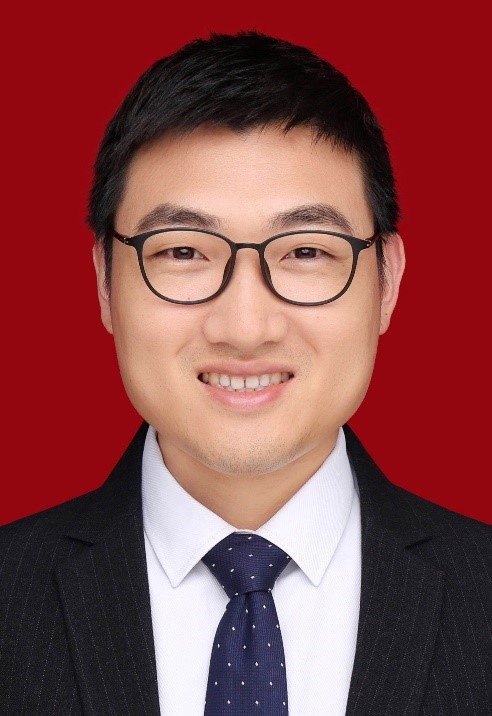

<!-- AUTO-GENERATED-BY: work/generate_obsidian_profiles.py -->

<!-- TEMPLATE: D:\workspace\信息收集整理\医生画像仓库\模板\医生画像模板.md -->

# 柳亚启

## 基础信息

| 字段 | 内容 |
|---|---|
| 姓名 | 柳亚启 |
| 医院 | 中山大学附属第三医院 |
| 科室 | 脑血管外科 |
| 职称/身份 | 主治医师 |
| 来源链接 | [官网原文](https://www.zssy.com.cn/node/16232) |
| 采集日期 | 2026-08-10 |

## 简介/擅长

擅长脑血管常见疾病，如：颅内动脉瘤、脑动静脉畸形、颈动脉海绵窦瘘、烟雾病，颈动脉、椎动脉狭窄的介入及微创手术治疗，以及急性缺血性脑卒中的取栓治疗，现为密网支架植入带教导师。 目前已完成各类脑血管病手术近4000台。

## 可包装亮点

- 广东省医学会神经介入学分会委员 广东省医师协会神经介入医师分会青年委员 广东省医学教育协会脑卒中急救与防治专委会秘书、常务委员 广东省医疗行业协会脑血管病管理分会委员 从事脑血管疾病医教研工作十余年，

## 重点疾病/人群标签

- 慢性病：
- 肿瘤：瘤
- 生殖疾病：
- 免疫/风湿：
- 术后恢复/康复：
- 疑难重症：

## 证据摘录

> 只摘录官网公开信息中的短句或关键字段，不复制大段原文。

- 官网身份字段：主治医师
- 官网简介/擅长：擅长脑血管常见疾病，如：颅内动脉瘤、脑动静脉畸形、颈动脉海绵窦瘘、烟雾病，颈动脉、椎动脉狭窄的介入及微创手术治疗，以及急性缺血性脑卒中的取栓治疗，现为密网支架植入带教导师。 目前已完成各类脑血管病手术近4000台。
- 官网亮眼经历线索：广东省医学会神经介入学分会委员 广东省医师协会神经介入医师分会青年委员 广东省医学教育协会脑卒中急救与防治专委会秘书、常务委员 广东省医疗行业协会脑血管病管理分会委员 从事脑血管疾病医教研工作十余年，
- 来源链接：https://www.zssy.com.cn/node/16232

## BD 画像摘要

柳亚启医生可作为肿瘤方向的基础画像候选。后续 BD 使用应继续以官网来源和人工复核为准，不添加疗效承诺或无来源包装。

## 合规边界

- 仅使用医院官网、官方公众号、官方小程序等公开渠道。
- 不采集私人电话、私人微信、家庭住址、患者隐私或非公开排班信息。
- 不写“保证治愈”“疗效第一”“包治疑难杂症”等无法由官网证明的表述。
