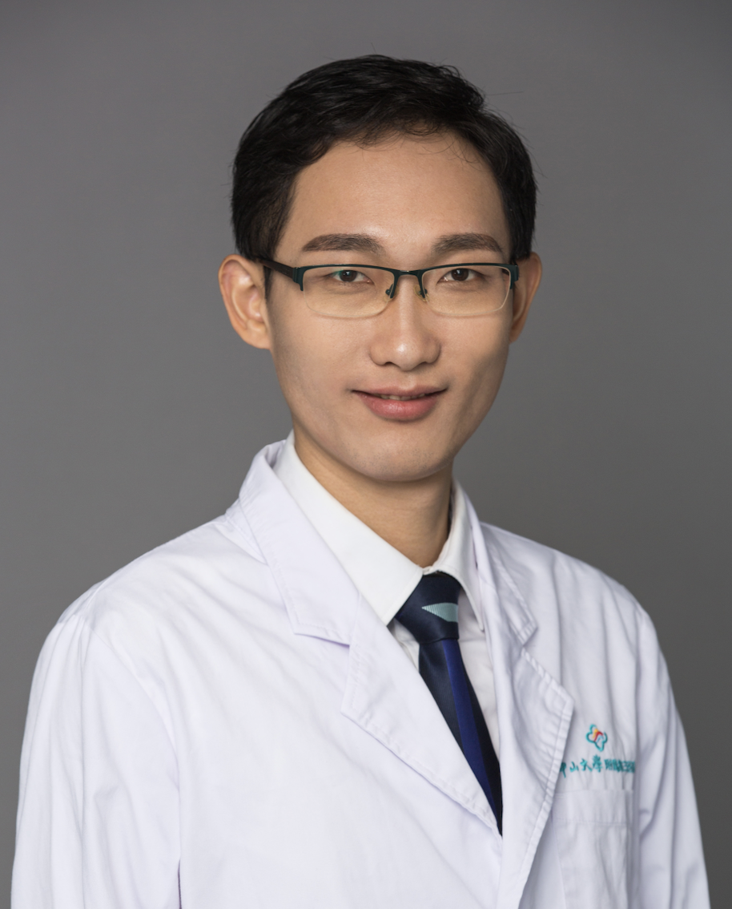

<!-- AUTO-GENERATED-BY: work/generate_obsidian_profiles.py -->

<!-- TEMPLATE: D:\workspace\信息收集整理\医生画像仓库\模板\医生画像模板.md -->

# 梁启祥

## 基础信息

| 字段 | 内容 |
|---|---|
| 姓名 | 梁启祥 |
| 医院 | 中山大学附属第三医院 |
| 科室 | 口腔科 |
| 职称/身份 | 副主任医师 导师资格 硕士生导师 |
| 来源链接 | [官网原文](https://www.zssy.com.cn/node/29961) |
| 采集日期 | 2026-08-10 |

## 简介/擅长

在数字化正颌-创伤外科领域有深入研究，擅长牙颌面畸形的外科手术治疗，专注于口腔颌面肿瘤的诊断与治疗，尤其注重术后功能性修复重建。对各类复杂牙拔除及颌面部骨折的处理具有丰富临床经验。

## 可包装亮点

- 副主任医师 导师资格 硕士生导师 博士，副主任医师，硕士生导师。
- 担任广东省口腔医学会口腔颌面外科专业委员会委员、广东省基层医药学会头颈肿瘤专业委员会委员、广东省医学会颌面-头颈外科学分会青年委员会委员、广东省整形美容协会青年学术委员会委员。

## 重点疾病/人群标签

- 慢性病：
- 肿瘤：肿瘤、术后、复杂
- 生殖疾病：
- 免疫/风湿：
- 术后恢复/康复：肿瘤、术后、复杂
- 疑难重症：肿瘤、术后、复杂

## 证据摘录

> 只摘录官网公开信息中的短句或关键字段，不复制大段原文。

- 官网身份字段：副主任医师 导师资格 硕士生导师
- 官网简介/擅长：在数字化正颌-创伤外科领域有深入研究，擅长牙颌面畸形的外科手术治疗，专注于口腔颌面肿瘤的诊断与治疗，尤其注重术后功能性修复重建。对各类复杂牙拔除及颌面部骨折的处理具有丰富临床经验。
- 官网亮眼经历线索：副主任医师 导师资格 硕士生导师 博士，副主任医师，硕士生导师。 担任广东省口腔医学会口腔颌面外科专业委员会委员、广东省基层医药学会头颈肿瘤专业委员会委员、广东省医学会颌面-头颈外科学分会青年委员会委员、广东省整形美容协会青年学术委员会委员。
- 来源链接：https://www.zssy.com.cn/node/29961

## BD 画像摘要

梁启祥医生可作为肿瘤、术后恢复/康复、疑难重症方向的基础画像候选。后续 BD 使用应继续以官网来源和人工复核为准，不添加疗效承诺或无来源包装。

## 合规边界

- 仅使用医院官网、官方公众号、官方小程序等公开渠道。
- 不采集私人电话、私人微信、家庭住址、患者隐私或非公开排班信息。
- 不写“保证治愈”“疗效第一”“包治疑难杂症”等无法由官网证明的表述。
