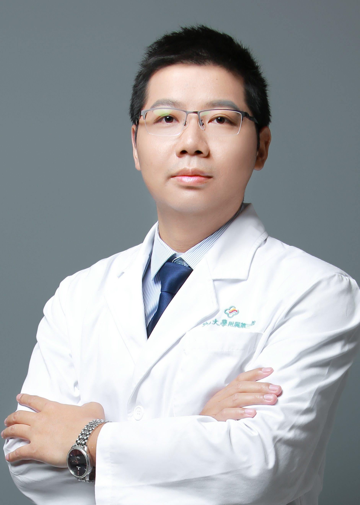

<!-- AUTO-GENERATED-BY: work/generate_obsidian_profiles.py -->

<!-- TEMPLATE: D:\workspace\信息收集整理\医生画像仓库\模板\医生画像模板.md -->

# 沈关驻

## 基础信息

| 字段 | 内容 |
|---|---|
| 姓名 | 沈关驻 |
| 医院 | 中山大学附属第三医院 |
| 科室 | 肿瘤放射治疗科 |
| 职称/身份 | 副主任医师 导师资格 硕士生导师 |
| 来源链接 | [官网原文](https://www.zssy.com.cn/node/15455) |
| 采集日期 | 2026-08-10 |

## 简介/擅长

鼻咽癌治疗专家，擅长鼻咽癌、头颈部肿瘤、神经系统恶性肿瘤、结直肠癌、前列腺癌等肿瘤的放射治疗及综合治疗

## 可包装亮点

- 副主任医师 导师资格 硕士生导师 中山大学肿瘤防治中心放射肿瘤学博士 中国抗癌协会肿瘤热疗专委会青委，广东省预防医学会肿瘤防治专委会秘书，广东省抗癌协会放疗专委会、神经肿瘤专委会、鼻咽癌专委会青委会委员，广东省医师学会放射治疗专委会头颈肿瘤学组、神经肿瘤学组组员，广东省临床医学会鼻咽癌精准治疗专委会委员，广东省医院协会第一届放疗科管理专委会青委，广东省健康…
- 以第一作者或共同第一作者身份发表在Annals of Oncology、Cancer Communication等顶级期刊在内高水平论文9篇。

## 重点疾病/人群标签

- 慢性病：
- 肿瘤：肿瘤、癌、放疗、鼻咽癌、肠癌、营养
- 生殖疾病：
- 免疫/风湿：
- 术后恢复/康复：肿瘤、癌、放疗、鼻咽癌、肠癌、营养
- 疑难重症：

## 证据摘录

> 只摘录官网公开信息中的短句或关键字段，不复制大段原文。

- 官网身份字段：副主任医师 导师资格 硕士生导师
- 官网简介/擅长：鼻咽癌治疗专家，擅长鼻咽癌、头颈部肿瘤、神经系统恶性肿瘤、结直肠癌、前列腺癌等肿瘤的放射治疗及综合治疗
- 官网亮眼经历线索：副主任医师 导师资格 硕士生导师 中山大学肿瘤防治中心放射肿瘤学博士 中国抗癌协会肿瘤热疗专委会青委，广东省预防医学会肿瘤防治专委会秘书，广东省抗癌协会放疗专委会、神经肿瘤专委会、鼻咽癌专委会青委会委员，广东省医师学会放射治疗专委会头颈肿瘤学组、神经肿瘤学组组员，广东省临床医学会鼻咽癌精准治疗专委会委员，广东省医院协会第一届放疗科管理专委会青委，广东省健康管理学会胃肠病学专委会委员，广东省基层医药学会肿瘤综合诊疗专委会胸部肿瘤专委会委…
- 来源链接：https://www.zssy.com.cn/node/15455

## BD 画像摘要

沈关驻医生可作为肿瘤、术后恢复/康复方向的基础画像候选。后续 BD 使用应继续以官网来源和人工复核为准，不添加疗效承诺或无来源包装。

## 合规边界

- 仅使用医院官网、官方公众号、官方小程序等公开渠道。
- 不采集私人电话、私人微信、家庭住址、患者隐私或非公开排班信息。
- 不写“保证治愈”“疗效第一”“包治疑难杂症”等无法由官网证明的表述。
