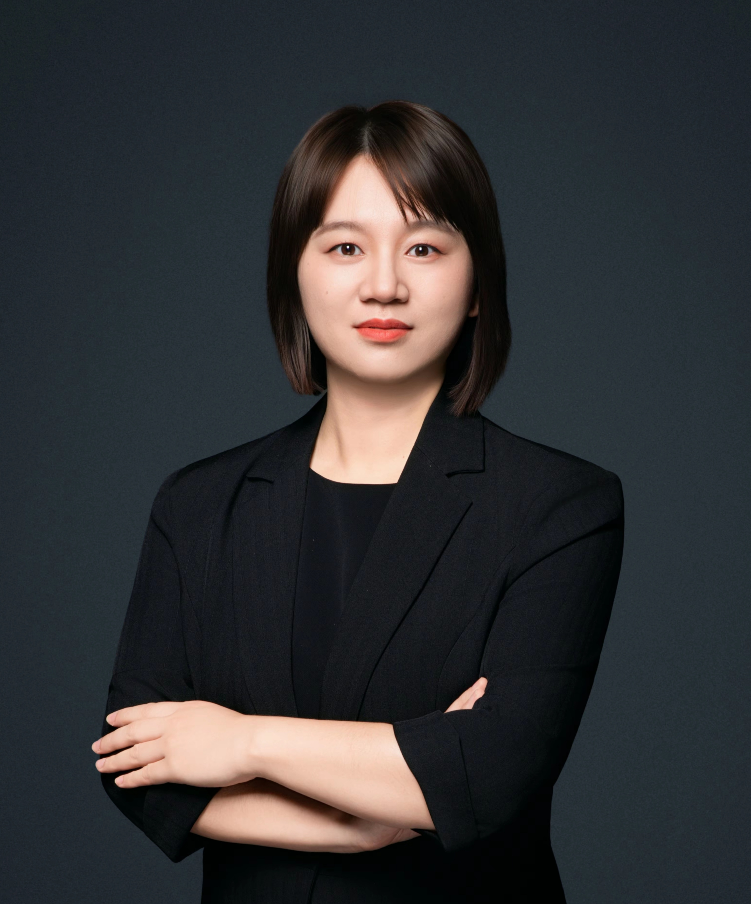

<!-- AUTO-GENERATED-BY: work/generate_obsidian_profiles.py -->

<!-- TEMPLATE: D:\workspace\信息收集整理\医生画像仓库\模板\医生画像模板.md -->

# 罗婧

## 基础信息

| 字段 | 内容 |
|---|---|
| 姓名 | 罗婧 |
| 医院 | 中山大学附属第三医院 |
| 科室 | 康复医学科 |
| 职称/身份 | 副主任医师 导师资格 硕士生导师 |
| 来源链接 | [官网原文](https://www.zssy.com.cn/node/28147) |
| 采集日期 | 2026-08-10 |

## 简介/擅长

脑卒中、脑外伤、脊髓损伤、意识障碍等神经系统疾病导致的运动、认知、言语、吞咽、呼吸等功能障碍的康复评估与治疗等。尤其擅长TMS、tDCS等神经调控技术在康复中的应用、重症患者的康复管理等，如气管切开合并吞咽困难、意识障碍的促醒治疗、心脏、呼吸、消化、泌尿等系统的综合康复治疗等。

## 可包装亮点

- 副主任医师 导师资格 硕士生导师 罗婧，副主任医师，硕士生导师，医学博士。
- 现任中国医师协会康复医师分会重症康复学组组员、中国康复医学会脑血管病及脑功能检测与调控专委会青委会委员、广东省康复医学脑功能检测与调控康复分会委员、广东省医学会物理医学与康复学分会/医师协会康复科医师分会前任/现任秘书。
- 研究方向为脑损伤后的神经可塑性机制，神经干细胞、外泌体囊泡、神经炎症、脑功能网络等基础与临床研究，发表相关SCI论著20余篇；

## 重点疾病/人群标签

- 慢性病：
- 肿瘤：
- 生殖疾病：
- 免疫/风湿：
- 术后恢复/康复：康复、功能障碍、重症
- 疑难重症：康复、功能障碍、重症

## 证据摘录

> 只摘录官网公开信息中的短句或关键字段，不复制大段原文。

- 官网身份字段：副主任医师 导师资格 硕士生导师
- 官网简介/擅长：脑卒中、脑外伤、脊髓损伤、意识障碍等神经系统疾病导致的运动、认知、言语、吞咽、呼吸等功能障碍的康复评估与治疗等。尤其擅长TMS、tDCS等神经调控技术在康复中的应用、重症患者的康复管理等，如气管切开合并吞咽困难、意识障碍的促醒治疗、心脏、呼吸、消化、泌尿等系统的综合康复治疗等。
- 官网亮眼经历线索：副主任医师 导师资格 硕士生导师 罗婧，副主任医师，硕士生导师，医学博士。 现任中国医师协会康复医师分会重症康复学组组员、中国康复医学会脑血管病及脑功能检测与调控专委会青委会委员、广东省康复医学脑功能检测与调控康复分会委员、广东省医学会物理医学与康复学分会/医师协会康复科医师分会前任/现任秘书。 研究方向为脑损伤后的神经可塑性机制，神经干细胞、外泌体囊泡、神经炎症、脑功能网络等基础与临床研究，发表相关SCI论著20余篇；
- 来源链接：https://www.zssy.com.cn/node/28147

## BD 画像摘要

罗婧医生可作为术后恢复/康复、疑难重症方向的基础画像候选。后续 BD 使用应继续以官网来源和人工复核为准，不添加疗效承诺或无来源包装。

## 合规边界

- 仅使用医院官网、官方公众号、官方小程序等公开渠道。
- 不采集私人电话、私人微信、家庭住址、患者隐私或非公开排班信息。
- 不写“保证治愈”“疗效第一”“包治疑难杂症”等无法由官网证明的表述。
