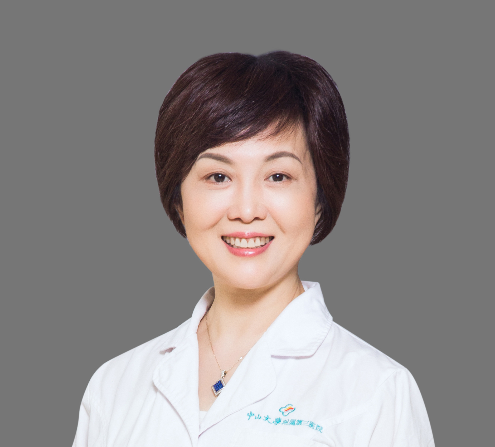

<!-- AUTO-GENERATED-BY: work/generate_obsidian_profiles.py -->

<!-- TEMPLATE: D:\workspace\信息收集整理\医生画像仓库\模板\医生画像模板.md -->

# 艾虹

## 基础信息

| 字段 | 内容 |
|---|---|
| 姓名 | 艾虹 |
| 医院 | 中山大学附属第三医院 |
| 科室 | 口腔科 |
| 职称/身份 | 教授 导师资格 博士生导师 |
| 来源链接 | [官网原文](https://www.zssy.com.cn/node/14212) |
| 采集日期 | 2026-08-10 |

## 简介/擅长

各类颅颌面畸形的唇、舌侧及隐形等矫治技术，唇腭裂序列治疗，颞下颌关节病的序列治疗，牙周病的序列治疗，骨性错颌畸形的正畸正颌联合治疗

## 可包装亮点

- 教授 导师资格 博士生导师 主任医师，教授，博士生导师，中山大学附属第三医院口腔医学中心学科带头人，中华口腔医学会正畸专委会常委，广东省口腔医学会正畸专委会副主任委员，世界正畸联盟（WFO）会员，《中华正畸学杂志》编委。
- 从事口腔正畸临床工作二十余年，曾留学美国2年，对儿童、青少年及成人各类错合畸形矫治有较深的造诣。
- 将传统正畸与数字化正畸思维有机融合，率先开展数字化隐形矫正，并开展正畸-正颌、牙周-正畸联合治疗，以及伴有颞下颌关节紊乱病的错合畸形的序列治疗等，最大程度提升患者的面型美观及功能健康。

## 重点疾病/人群标签

- 慢性病：
- 肿瘤：
- 生殖疾病：
- 免疫/风湿：
- 术后恢复/康复：
- 疑难重症：

## 证据摘录

> 只摘录官网公开信息中的短句或关键字段，不复制大段原文。

- 官网身份字段：教授 导师资格 博士生导师
- 官网简介/擅长：各类颅颌面畸形的唇、舌侧及隐形等矫治技术，唇腭裂序列治疗，颞下颌关节病的序列治疗，牙周病的序列治疗，骨性错颌畸形的正畸正颌联合治疗
- 官网亮眼经历线索：教授 导师资格 博士生导师 主任医师，教授，博士生导师，中山大学附属第三医院口腔医学中心学科带头人，中华口腔医学会正畸专委会常委，广东省口腔医学会正畸专委会副主任委员，世界正畸联盟（WFO）会员，《中华正畸学杂志》编委。 从事口腔正畸临床工作二十余年，曾留学美国2年，对儿童、青少年及成人各类错合畸形矫治有较深的造诣。 将传统正畸与数字化正畸思维有机融合，率先开展数字化隐形矫正，并开展正畸-正颌、牙周-正畸联合治疗，以及伴有颞下颌关节紊…
- 来源链接：https://www.zssy.com.cn/node/14212

## BD 画像摘要

艾虹医生可作为中山大学附属第三医院口腔科的基础医生资料入库。当前重点方向以总底表标签为准，官网未展示的信息保持空白。

## 合规边界

- 仅使用医院官网、官方公众号、官方小程序等公开渠道。
- 不采集私人电话、私人微信、家庭住址、患者隐私或非公开排班信息。
- 不写“保证治愈”“疗效第一”“包治疑难杂症”等无法由官网证明的表述。
