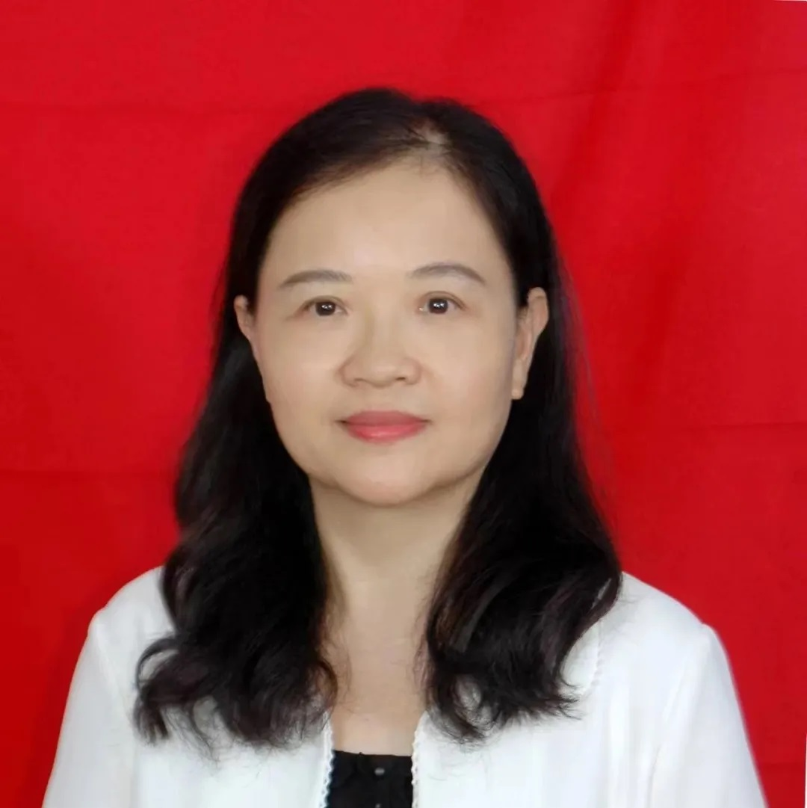

<!-- AUTO-GENERATED-BY: work/generate_obsidian_profiles.py -->

<!-- TEMPLATE: D:\workspace\信息收集整理\医生画像仓库\模板\医生画像模板.md -->

# 苏向阳

## 基础信息

| 字段 | 内容 |
|---|---|
| 姓名 | 苏向阳 |
| 医院 | 中山大学附属第三医院 |
| 科室 | 化妆品评价中心 |
| 职称/身份 | 主任医师 导师资格 硕士生导师 |
| 来源链接 | [官网原文](https://www.zssy.com.cn/node/15318) |
| 采集日期 | 2026-08-10 |

## 简介/擅长

2003年以来，从事化妆品人体安全性和功效评价和检测工作近22年，主要进行人体试用试验，同时参与其他化妆品功效试验评价，累计完成人体试用试验超过600项，参与其他化妆品功效试验超过100项。

## 可包装亮点

- 主任医师 导师资格 硕士生导师

## 重点疾病/人群标签

- 慢性病：
- 肿瘤：
- 生殖疾病：
- 免疫/风湿：
- 术后恢复/康复：
- 疑难重症：

## 证据摘录

> 只摘录官网公开信息中的短句或关键字段，不复制大段原文。

- 官网身份字段：主任医师 导师资格 硕士生导师
- 官网简介/擅长：2003年以来，从事化妆品人体安全性和功效评价和检测工作近22年，主要进行人体试用试验，同时参与其他化妆品功效试验评价，累计完成人体试用试验超过600项，参与其他化妆品功效试验超过100项。
- 官网亮眼经历线索：主任医师 导师资格 硕士生导师
- 来源链接：https://www.zssy.com.cn/node/15318

## BD 画像摘要

苏向阳医生可作为中山大学附属第三医院化妆品评价中心的基础医生资料入库。当前重点方向以总底表标签为准，官网未展示的信息保持空白。

## 合规边界

- 仅使用医院官网、官方公众号、官方小程序等公开渠道。
- 不采集私人电话、私人微信、家庭住址、患者隐私或非公开排班信息。
- 不写“保证治愈”“疗效第一”“包治疑难杂症”等无法由官网证明的表述。
