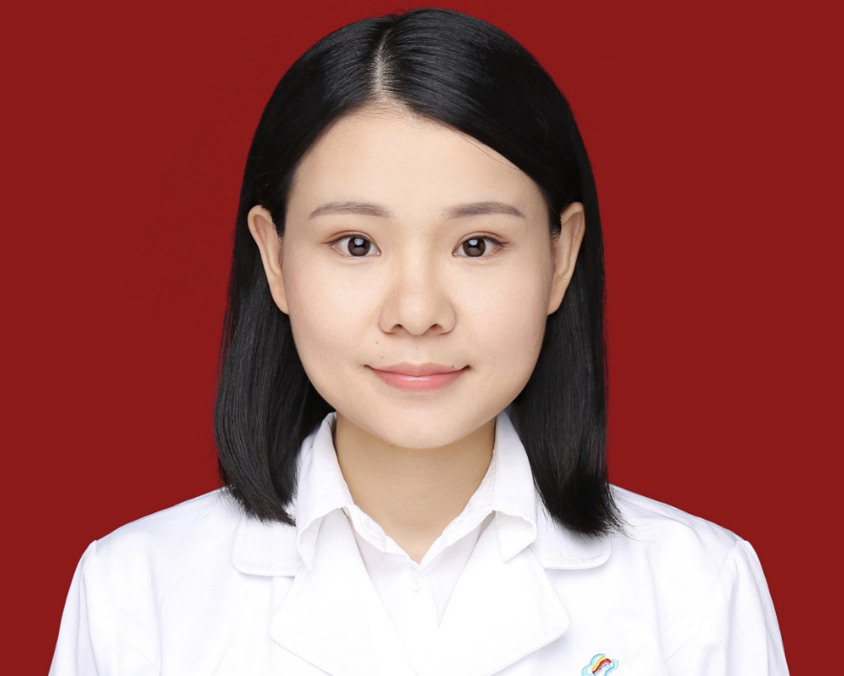

<!-- AUTO-GENERATED-BY: work/generate_obsidian_profiles.py -->

<!-- TEMPLATE: D:\workspace\信息收集整理\医生画像仓库\模板\医生画像模板.md -->

# 蒋慧云

## 基础信息

| 字段 | 内容 |
|---|---|
| 姓名 | 蒋慧云 |
| 医院 | 中山大学附属第三医院 |
| 科室 | 妇科 |
| 职称/身份 | 副主任医师 导师资格 硕士生导师 |
| 来源链接 | [官网原文](https://www.zssy.com.cn/node/29964) |
| 采集日期 | 2026-08-10 |

## 简介/擅长

1、擅长妇科良恶性肿瘤（如子宫肌瘤、宫颈癌、子宫内膜癌、卵巢囊肿等）及子宫内膜异位症的诊断、手术与综合管理。2、精通腹腔镜、开腹、阴式手术等多种手术技术。3、擅长单孔腹腔镜子宫肌瘤及卵巢囊肿微创手术。

## 可包装亮点

- 副主任医师 导师资格 硕士生导师 担任广东省医学会妇科肿瘤学分会、广东省医师协会子宫内膜异位症专业委员会等多个专业委员会委员。

## 重点疾病/人群标签

- 慢性病：
- 肿瘤：肿瘤、癌、瘤、卵巢
- 生殖疾病：肿瘤、癌、瘤、卵巢
- 免疫/风湿：
- 术后恢复/康复：
- 疑难重症：

## 证据摘录

> 只摘录官网公开信息中的短句或关键字段，不复制大段原文。

- 官网身份字段：副主任医师 导师资格 硕士生导师
- 官网简介/擅长：1、擅长妇科良恶性肿瘤（如子宫肌瘤、宫颈癌、子宫内膜癌、卵巢囊肿等）及子宫内膜异位症的诊断、手术与综合管理。2、精通腹腔镜、开腹、阴式手术等多种手术技术。3、擅长单孔腹腔镜子宫肌瘤及卵巢囊肿微创手术。
- 官网亮眼经历线索：副主任医师 导师资格 硕士生导师 担任广东省医学会妇科肿瘤学分会、广东省医师协会子宫内膜异位症专业委员会等多个专业委员会委员。
- 来源链接：https://www.zssy.com.cn/node/29964

## BD 画像摘要

蒋慧云医生可作为肿瘤、生殖疾病方向的基础画像候选。后续 BD 使用应继续以官网来源和人工复核为准，不添加疗效承诺或无来源包装。

## 合规边界

- 仅使用医院官网、官方公众号、官方小程序等公开渠道。
- 不采集私人电话、私人微信、家庭住址、患者隐私或非公开排班信息。
- 不写“保证治愈”“疗效第一”“包治疑难杂症”等无法由官网证明的表述。
