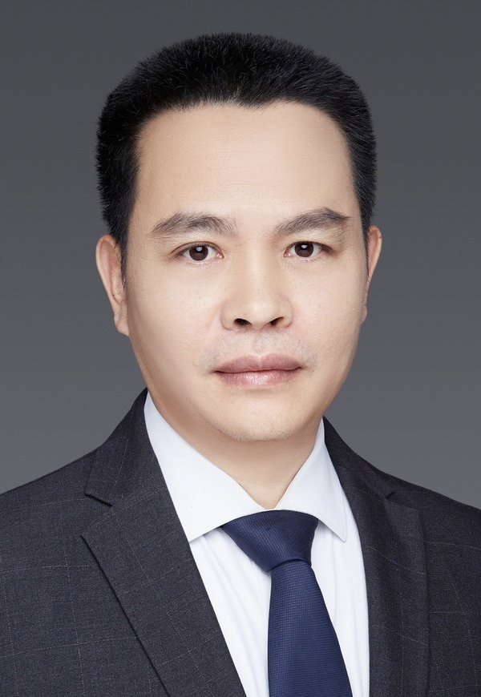

<!-- AUTO-GENERATED-BY: work/generate_obsidian_profiles.py -->

<!-- TEMPLATE: D:\workspace\信息收集整理\医生画像仓库\模板\医生画像模板.md -->

# 蔡梅钦

## 基础信息

| 字段 | 内容 |
|---|---|
| 姓名 | 蔡梅钦 |
| 医院 | 中山大学附属第三医院 |
| 科室 | 神经外科 |
| 职称/身份 | 主任医师 导师资格 硕士生导师 |
| 来源链接 | [官网原文](https://www.zssy.com.cn/node/14252) |
| 采集日期 | 2026-08-10 |

## 简介/擅长

擅长神经内镜经蝶鞍区肿瘤（垂体瘤、鞍结节脑膜瘤、颅咽管瘤）手术，神经内镜经颅锁孔颅底肿瘤（脑膜瘤、听神经瘤、表皮样囊肿，等）手术和神经内镜经颅锁孔微血管减压（三叉神经痛、面肌痉挛）手术。

## 可包装亮点

- 主任医师 导师资格 硕士生导师 医学博士，硕士生导师，主任医师，现任中国医药教育协会神经内镜与微创医学专业委员会委员，广东省基层医药学会神经外科专业委员会常务委员，广东省医学会神经外科分会第八届委员会颅底鞍区学组成员，广东省医师协会神经外科医师分会第三届颅底专业委员会委员，广东省精准医学应用学会神经肿瘤分会委员。
- 在国内/外核心期刊发表垂体瘤、颅咽管瘤、鞍结节脑膜瘤、拉特克氏囊肿的锁孔/内镜手术相关文章40余篇，其中第一作者或通讯作者SCI文章10余篇。

## 重点疾病/人群标签

- 慢性病：
- 肿瘤：肿瘤、瘤
- 生殖疾病：
- 免疫/风湿：
- 术后恢复/康复：
- 疑难重症：

## 证据摘录

> 只摘录官网公开信息中的短句或关键字段，不复制大段原文。

- 官网身份字段：主任医师 导师资格 硕士生导师
- 官网简介/擅长：擅长神经内镜经蝶鞍区肿瘤（垂体瘤、鞍结节脑膜瘤、颅咽管瘤）手术，神经内镜经颅锁孔颅底肿瘤（脑膜瘤、听神经瘤、表皮样囊肿，等）手术和神经内镜经颅锁孔微血管减压（三叉神经痛、面肌痉挛）手术。
- 官网亮眼经历线索：主任医师 导师资格 硕士生导师 医学博士，硕士生导师，主任医师，现任中国医药教育协会神经内镜与微创医学专业委员会委员，广东省基层医药学会神经外科专业委员会常务委员，广东省医学会神经外科分会第八届委员会颅底鞍区学组成员，广东省医师协会神经外科医师分会第三届颅底专业委员会委员，广东省精准医学应用学会神经肿瘤分会委员。 在国内/外核心期刊发表垂体瘤、颅咽管瘤、鞍结节脑膜瘤、拉特克氏囊肿的锁孔/内镜手术相关文章40余篇，其中第一作者或通讯作者…
- 来源链接：https://www.zssy.com.cn/node/14252

## BD 画像摘要

蔡梅钦医生可作为肿瘤方向的基础画像候选。后续 BD 使用应继续以官网来源和人工复核为准，不添加疗效承诺或无来源包装。

## 合规边界

- 仅使用医院官网、官方公众号、官方小程序等公开渠道。
- 不采集私人电话、私人微信、家庭住址、患者隐私或非公开排班信息。
- 不写“保证治愈”“疗效第一”“包治疑难杂症”等无法由官网证明的表述。
