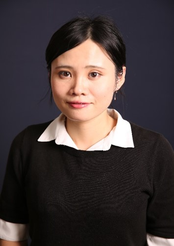

<!-- AUTO-GENERATED-BY: work/generate_obsidian_profiles.py -->

<!-- TEMPLATE: D:\workspace\信息收集整理\医生画像仓库\模板\医生画像模板.md -->

# 蔡蔚

## 基础信息

| 字段 | 内容 |
|---|---|
| 姓名 | 蔡蔚 |
| 医院 | 中山大学附属第三医院 |
| 科室 | 神经内科 |
| 职称/身份 | 副研究员 导师资格 硕士生导师 |
| 来源链接 | [官网原文](https://www.zssy.com.cn/node/28409) |
| 采集日期 | 2026-08-10 |

## 简介/擅长

神经系统疾病的基础研究。2014-2017年于匹兹堡大学医学中心神经病学研究中心访学。 主要学术成就：主持国家脑计划青年项目、广东省杰出青年基金、国家自然科学基金面上项目等课题；先后获得国际脑血流与代谢学会Niels Lassen Award、中国卒中学会青年创新奖、广东省科技进步奖、广东省高质量论文奖等荣誉；在Nat Aging、JCI、Nature Communications、Science Advances、Brain、Stroke 等国际知名杂志发表多篇研究论文。

## 可包装亮点

- 副研究员 导师资格 硕士生导师 主要学术成就：主持国家脑计划青年项目、广东省杰出青年基金、国家自然科学基金面上项目等课题；
- 先后获得国际脑血流与代谢学会Niels Lassen Award、中国卒中学会青年创新奖、广东省科技进步奖、广东省高质量论文奖等荣誉；
- 在Nat Aging、JCI、Nature Communications、Science Advances、Brain、Stroke 等国际知名杂志发表多篇研究论文。

## 重点疾病/人群标签

- 慢性病：代谢、免疫
- 肿瘤：
- 生殖疾病：
- 免疫/风湿：代谢、免疫
- 术后恢复/康复：
- 疑难重症：

## 证据摘录

> 只摘录官网公开信息中的短句或关键字段，不复制大段原文。

- 官网身份字段：副研究员 导师资格 硕士生导师
- 官网简介/擅长：神经系统疾病的基础研究。2014-2017年于匹兹堡大学医学中心神经病学研究中心访学。 主要学术成就：主持国家脑计划青年项目、广东省杰出青年基金、国家自然科学基金面上项目等课题；先后获得国际脑血流与代谢学会Niels Lassen Award、中国卒中学会青年创新奖、广东省科技进步奖、广东省高质量论文奖等荣誉；在Nat Aging、JCI、Nature Communications、Science Advances、Brain、Str…
- 官网亮眼经历线索：副研究员 导师资格 硕士生导师 主要学术成就：主持国家脑计划青年项目、广东省杰出青年基金、国家自然科学基金面上项目等课题； 先后获得国际脑血流与代谢学会Niels Lassen Award、中国卒中学会青年创新奖、广东省科技进步奖、广东省高质量论文奖等荣誉； 在Nat Aging、JCI、Nature Communications、Science Advances、Brain、Stroke 等国际知名杂志发表多篇研究论文。
- 来源链接：https://www.zssy.com.cn/node/28409

## BD 画像摘要

蔡蔚医生可作为慢性病、免疫/风湿/感染方向的基础画像候选。后续 BD 使用应继续以官网来源和人工复核为准，不添加疗效承诺或无来源包装。

## 合规边界

- 仅使用医院官网、官方公众号、官方小程序等公开渠道。
- 不采集私人电话、私人微信、家庭住址、患者隐私或非公开排班信息。
- 不写“保证治愈”“疗效第一”“包治疑难杂症”等无法由官网证明的表述。
