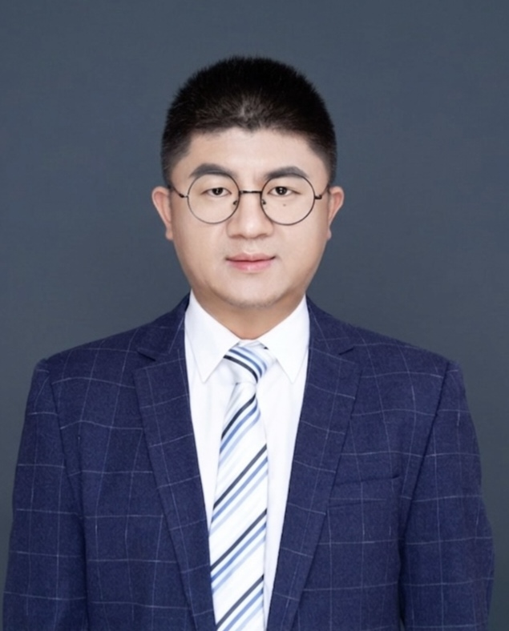

<!-- AUTO-GENERATED-BY: work/generate_obsidian_profiles.py -->

<!-- TEMPLATE: D:\workspace\信息收集整理\医生画像仓库\模板\医生画像模板.md -->

# 解东风

## 基础信息

| 字段 | 内容 |
|---|---|
| 姓名 | 解东风 |
| 医院 | 中山大学附属第三医院 |
| 科室 | 康复医学科 |
| 职称/身份 | 副主任技师 导师资格 硕士生导师 |
| 来源链接 | [官网原文](https://www.zssy.com.cn/node/29833) |
| 采集日期 | 2026-08-10 |

## 简介/擅长

颈肩腰腿痛ICF分类诊疗康复、全周期孕产康复、青少年及成人脊柱侧弯康复、运动损伤及骨科术后康复、神经疾病康复等

## 可包装亮点

- 副主任技师 导师资格 硕士生导师 现任广东省康复医学会康复治疗分会常务理事、广东省康复医学会运动与创伤康复分会常务理事、中日医学科技交流协会运动医学与康复分会副会长、广州市残疾预防及综合干预专家库成员、广州市健康科普专家等。
- 已发表第一/通讯作者专业论著10余篇，参编参译著作7部，获2020年“中国康复医学会科学技术奖”一等奖，获得国家实用新型专利和外观设计专利多项。

## 重点疾病/人群标签

- 慢性病：
- 肿瘤：
- 生殖疾病：
- 免疫/风湿：
- 术后恢复/康复：术后、康复
- 疑难重症：

## 证据摘录

> 只摘录官网公开信息中的短句或关键字段，不复制大段原文。

- 官网身份字段：副主任技师 导师资格 硕士生导师
- 官网简介/擅长：颈肩腰腿痛ICF分类诊疗康复、全周期孕产康复、青少年及成人脊柱侧弯康复、运动损伤及骨科术后康复、神经疾病康复等
- 官网亮眼经历线索：副主任技师 导师资格 硕士生导师 现任广东省康复医学会康复治疗分会常务理事、广东省康复医学会运动与创伤康复分会常务理事、中日医学科技交流协会运动医学与康复分会副会长、广州市残疾预防及综合干预专家库成员、广州市健康科普专家等。 已发表第一/通讯作者专业论著10余篇，参编参译著作7部，获2020年“中国康复医学会科学技术奖”一等奖，获得国家实用新型专利和外观设计专利多项。
- 来源链接：https://www.zssy.com.cn/node/29833

## BD 画像摘要

解东风医生可作为术后恢复/康复方向的基础画像候选。后续 BD 使用应继续以官网来源和人工复核为准，不添加疗效承诺或无来源包装。

## 合规边界

- 仅使用医院官网、官方公众号、官方小程序等公开渠道。
- 不采集私人电话、私人微信、家庭住址、患者隐私或非公开排班信息。
- 不写“保证治愈”“疗效第一”“包治疑难杂症”等无法由官网证明的表述。
