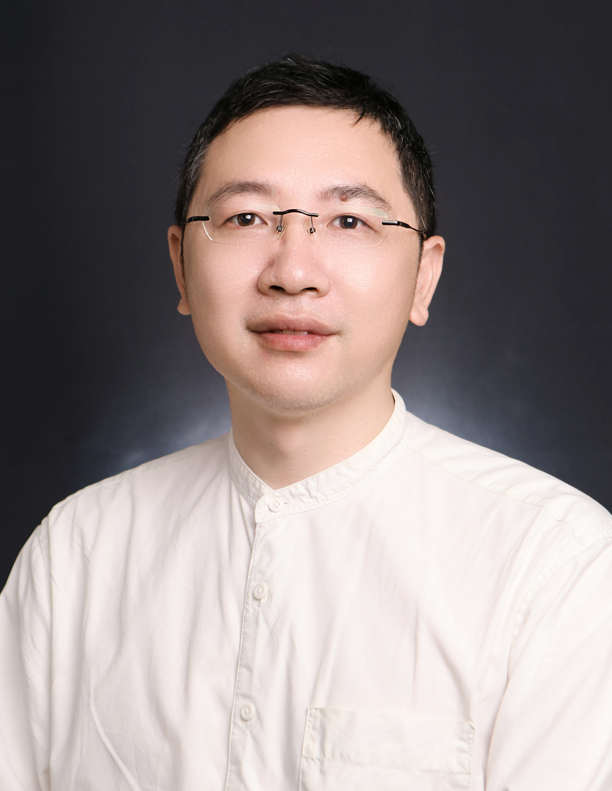

<!-- AUTO-GENERATED-BY: work/generate_obsidian_profiles.py -->

<!-- TEMPLATE: D:\workspace\信息收集整理\医生画像仓库\模板\医生画像模板.md -->

# 詹国栋

## 基础信息

| 字段 | 内容 |
|---|---|
| 姓名 | 詹国栋 |
| 医院 | 中山大学附属第三医院 |
| 科室 | 儿童行为发育中心 |
| 职称/身份 | 副主任医师 |
| 来源链接 | [官网原文](https://www.zssy.com.cn/node/29978) |
| 采集日期 | 2026-08-10 |

## 简介/擅长

儿童发育行为专家。从事发育行为儿科学和临床遗传学工作10余年。擅长孤独症谱系障碍、注意缺陷多动障碍、学习障碍、抽动障碍、智力障碍、发育迟缓等的诊断与干预。对罕见遗传性神经发育障碍的诊治有丰富的经验。

## 可包装亮点

- 副主任医师 世界卫生组织照顾者技能培训（WHO-CST）项目国家级主培训师，广东省柯麟医学教育基金会临床医学专业优秀教师，广东省医院协会罕见病专委会第一届委员。
- 主持科研项目5项，在Science Bulletin 等期刊发表多篇论文。

## 重点疾病/人群标签

- 慢性病：
- 肿瘤：
- 生殖疾病：
- 免疫/风湿：
- 术后恢复/康复：
- 疑难重症：罕见

## 证据摘录

> 只摘录官网公开信息中的短句或关键字段，不复制大段原文。

- 官网身份字段：副主任医师
- 官网简介/擅长：儿童发育行为专家。从事发育行为儿科学和临床遗传学工作10余年。擅长孤独症谱系障碍、注意缺陷多动障碍、学习障碍、抽动障碍、智力障碍、发育迟缓等的诊断与干预。对罕见遗传性神经发育障碍的诊治有丰富的经验。
- 官网亮眼经历线索：副主任医师 世界卫生组织照顾者技能培训（WHO-CST）项目国家级主培训师，广东省柯麟医学教育基金会临床医学专业优秀教师，广东省医院协会罕见病专委会第一届委员。 主持科研项目5项，在Science Bulletin 等期刊发表多篇论文。
- 来源链接：https://www.zssy.com.cn/node/29978

## BD 画像摘要

詹国栋医生可作为疑难重症方向的基础画像候选。后续 BD 使用应继续以官网来源和人工复核为准，不添加疗效承诺或无来源包装。

## 合规边界

- 仅使用医院官网、官方公众号、官方小程序等公开渠道。
- 不采集私人电话、私人微信、家庭住址、患者隐私或非公开排班信息。
- 不写“保证治愈”“疗效第一”“包治疑难杂症”等无法由官网证明的表述。
