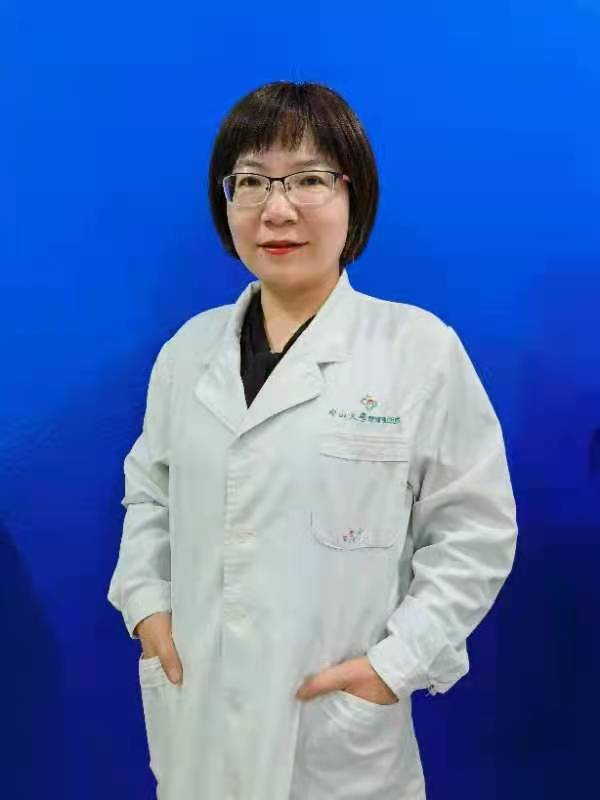

<!-- AUTO-GENERATED-BY: work/generate_obsidian_profiles.py -->

<!-- TEMPLATE: D:\workspace\信息收集整理\医生画像仓库\模板\医生画像模板.md -->

# 谢小元

## 基础信息

| 字段 | 内容 |
|---|---|
| 姓名 | 谢小元 |
| 医院 | 中山大学附属第三医院 |
| 科室 | 皮肤性病科 |
| 职称/身份 | 副主任医师 |
| 来源链接 | [官网原文](https://www.zssy.com.cn/node/15329) |
| 采集日期 | 2026-08-10 |

## 简介/擅长

长期从事皮肤科临床诊疗工作，擅长皮肤科常见病及多发病的诊治（皮炎、湿疹、银屑病、感染性皮肤病等）。尤其擅长于损容性皮肤病、化妆品皮肤病、脱发及女性疾病的诊治，擅长药物与光电技术、注射联合治疗痤疮、玫瑰痤疮、色素性皮肤病、血管性皮肤病、瘢痕及老化相关皮肤病等损容性皮肤病。

## 可包装亮点

- 副主任医师 副主任医师。
- 中国医师协会皮肤科分会注射美容学组成员，中国医师协会皮肤科分会痤疮学组成员，广州市医师协会激光美容与整形专业医师分会常委，广东省整形与美容协会青年组委员，广东省整形美容协会面部年轻化专业委员会委员。
- 中华医学会广东分会皮肤科学会微整形及注射学组成员，广东省化妆品不良反应监测专家组成员。

## 重点疾病/人群标签

- 慢性病：
- 肿瘤：
- 生殖疾病：
- 免疫/风湿：感染
- 术后恢复/康复：
- 疑难重症：

## 证据摘录

> 只摘录官网公开信息中的短句或关键字段，不复制大段原文。

- 官网身份字段：副主任医师
- 官网简介/擅长：长期从事皮肤科临床诊疗工作，擅长皮肤科常见病及多发病的诊治（皮炎、湿疹、银屑病、感染性皮肤病等）。尤其擅长于损容性皮肤病、化妆品皮肤病、脱发及女性疾病的诊治，擅长药物与光电技术、注射联合治疗痤疮、玫瑰痤疮、色素性皮肤病、血管性皮肤病、瘢痕及老化相关皮肤病等损容性皮肤病。
- 官网亮眼经历线索：副主任医师 副主任医师。 中国医师协会皮肤科分会注射美容学组成员，中国医师协会皮肤科分会痤疮学组成员，广州市医师协会激光美容与整形专业医师分会常委，广东省整形与美容协会青年组委员，广东省整形美容协会面部年轻化专业委员会委员。 中华医学会广东分会皮肤科学会微整形及注射学组成员，广东省化妆品不良反应监测专家组成员。
- 来源链接：https://www.zssy.com.cn/node/15329

## BD 画像摘要

谢小元医生可作为免疫/风湿/感染方向的基础画像候选。后续 BD 使用应继续以官网来源和人工复核为准，不添加疗效承诺或无来源包装。

## 合规边界

- 仅使用医院官网、官方公众号、官方小程序等公开渠道。
- 不采集私人电话、私人微信、家庭住址、患者隐私或非公开排班信息。
- 不写“保证治愈”“疗效第一”“包治疑难杂症”等无法由官网证明的表述。
