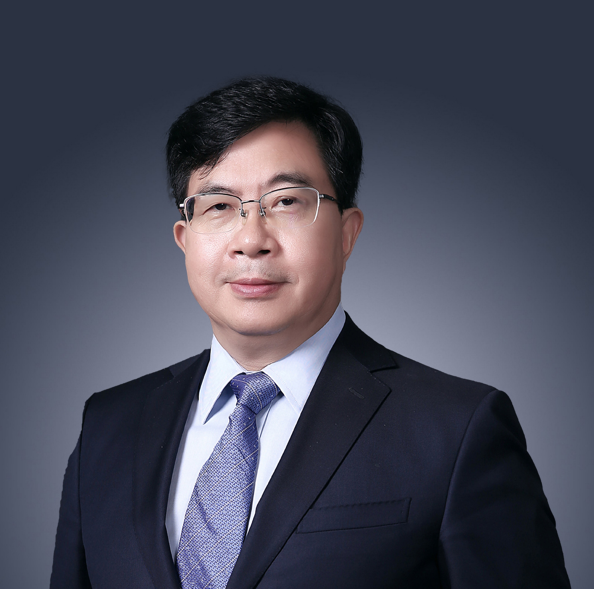

<!-- AUTO-GENERATED-BY: work/generate_obsidian_profiles.py -->

<!-- TEMPLATE: D:\workspace\信息收集整理\医生画像仓库\模板\医生画像模板.md -->

# 赖维

## 基础信息

| 字段 | 内容 |
|---|---|
| 姓名 | 赖维 |
| 医院 | 中山大学附属第三医院 |
| 科室 | 皮肤性病科 |
| 职称/身份 | 主任医师, 博导, 教授 |
| 来源链接 | [官网原文](https://www.zssy.com.cn/node/11307) |
| 采集日期 | 2026-08-10 |

## 简介/擅长

擅长疑难皮肤病的诊疗，在美容相关皮肤病（痤疮、玫瑰痤疮、黄褐斑、白癜风等）、过敏性皮肤病、化妆品引起的皮肤病及真菌性皮肤病等方面有深入的研究。

## 可包装亮点

- 主任医师, 博导, 教授 擅长疑难皮肤病的诊疗，在美容相关皮肤病（痤疮、玫瑰痤疮、黄褐斑、白癜风等）、过敏性皮肤病、化妆品引起的皮肤病及真菌性皮肤病等方面有深入的研究。
- 学科带头人、前科室主任、教授、主任医师、博士生导师。
- 中国医师协会皮肤科医师分会第四/第五届委员会副会长兼青委会主委、中华医学会皮肤性病学分会常委兼皮肤美容学组组长；

## 重点疾病/人群标签

- 慢性病：
- 肿瘤：
- 生殖疾病：
- 免疫/风湿：
- 术后恢复/康复：康复、疑难
- 疑难重症：康复、疑难

## 证据摘录

> 只摘录官网公开信息中的短句或关键字段，不复制大段原文。

- 官网身份字段：主任医师, 博导, 教授
- 官网简介/擅长：擅长疑难皮肤病的诊疗，在美容相关皮肤病（痤疮、玫瑰痤疮、黄褐斑、白癜风等）、过敏性皮肤病、化妆品引起的皮肤病及真菌性皮肤病等方面有深入的研究。
- 官网亮眼经历线索：主任医师, 博导, 教授 擅长疑难皮肤病的诊疗，在美容相关皮肤病（痤疮、玫瑰痤疮、黄褐斑、白癜风等）、过敏性皮肤病、化妆品引起的皮肤病及真菌性皮肤病等方面有深入的研究。 学科带头人、前科室主任、教授、主任医师、博士生导师。 中国医师协会皮肤科医师分会第四/第五届委员会副会长兼青委会主委、中华医学会皮肤性病学分会常委兼皮肤美容学组组长；
- 来源链接：https://www.zssy.com.cn/node/11307

## BD 画像摘要

赖维医生可作为术后恢复/康复、疑难重症方向的基础画像候选。后续 BD 使用应继续以官网来源和人工复核为准，不添加疗效承诺或无来源包装。

## 合规边界

- 仅使用医院官网、官方公众号、官方小程序等公开渠道。
- 不采集私人电话、私人微信、家庭住址、患者隐私或非公开排班信息。
- 不写“保证治愈”“疗效第一”“包治疑难杂症”等无法由官网证明的表述。
