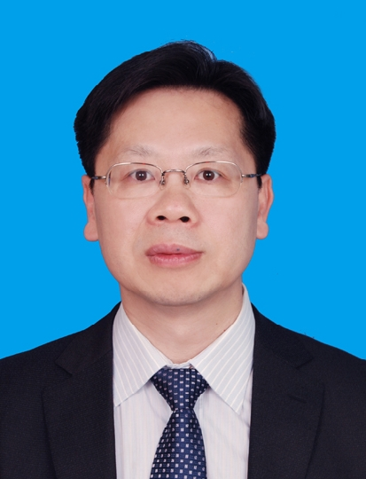

<!-- AUTO-GENERATED-BY: work/generate_obsidian_profiles.py -->

<!-- TEMPLATE: D:\workspace\信息收集整理\医生画像仓库\模板\医生画像模板.md -->

# 邱万寿

## 基础信息

| 字段 | 内容 |
|---|---|
| 姓名 | 邱万寿 |
| 医院 | 中山大学附属第三医院 |
| 科室 | 甲状腺、乳腺外科 |
| 职称/身份 | 主任医师 导师资格 硕士生导师 |
| 来源链接 | [官网原文](https://www.zssy.com.cn/node/14182) |
| 采集日期 | 2026-08-10 |

## 简介/擅长

乳腺癌诊断、乳腺良恶性肿瘤的手术治疗；甲状腺良恶性肿瘤的手术治疗。

## 可包装亮点

- 主任医师 导师资格 硕士生导师 2010年到韩国学习肿瘤整形手术， 2012年到美国哈佛大学麻省总医院乳腺外科学习，对乳腺癌的综合治疗和保乳术后的整形重建有较深入的研究。
- 在本专业核心期刊发表论文40余篇。
- 曾获中山医科大学优秀教学成果奖二项，参与编写专著《 围手术期监护治疗学 》。

## 重点疾病/人群标签

- 慢性病：
- 肿瘤：肿瘤、乳腺癌、术后
- 生殖疾病：
- 免疫/风湿：
- 术后恢复/康复：肿瘤、乳腺癌、术后
- 疑难重症：

## 证据摘录

> 只摘录官网公开信息中的短句或关键字段，不复制大段原文。

- 官网身份字段：主任医师 导师资格 硕士生导师
- 官网简介/擅长：乳腺癌诊断、乳腺良恶性肿瘤的手术治疗；甲状腺良恶性肿瘤的手术治疗。
- 官网亮眼经历线索：主任医师 导师资格 硕士生导师 2010年到韩国学习肿瘤整形手术， 2012年到美国哈佛大学麻省总医院乳腺外科学习，对乳腺癌的综合治疗和保乳术后的整形重建有较深入的研究。 在本专业核心期刊发表论文40余篇。 曾获中山医科大学优秀教学成果奖二项，参与编写专著《 围手术期监护治疗学 》。
- 来源链接：https://www.zssy.com.cn/node/14182

## BD 画像摘要

邱万寿医生可作为肿瘤、术后恢复/康复方向的基础画像候选。后续 BD 使用应继续以官网来源和人工复核为准，不添加疗效承诺或无来源包装。

## 合规边界

- 仅使用医院官网、官方公众号、官方小程序等公开渠道。
- 不采集私人电话、私人微信、家庭住址、患者隐私或非公开排班信息。
- 不写“保证治愈”“疗效第一”“包治疑难杂症”等无法由官网证明的表述。
