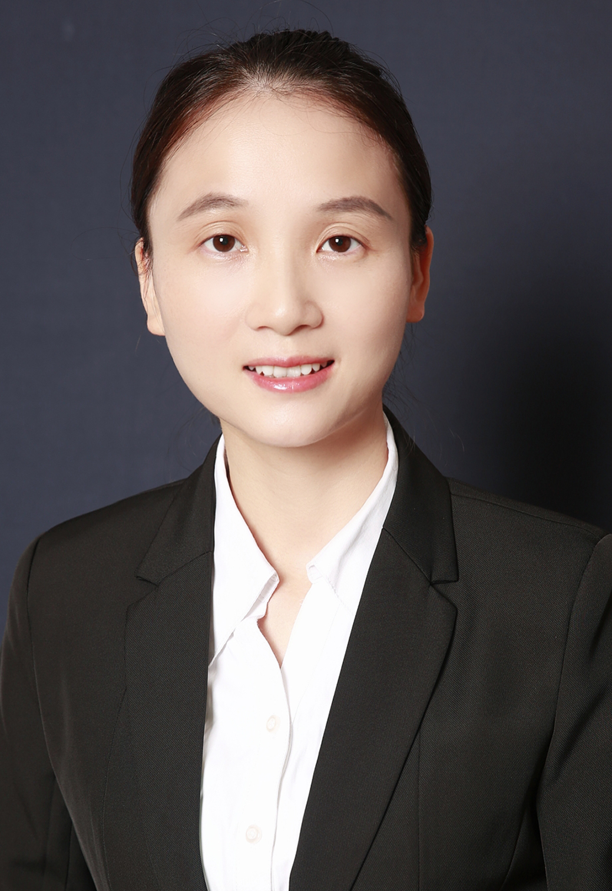

<!-- AUTO-GENERATED-BY: work/generate_obsidian_profiles.py -->

<!-- TEMPLATE: D:\workspace\信息收集整理\医生画像仓库\模板\医生画像模板.md -->

# 邹琼

## 基础信息

| 字段 | 内容 |
|---|---|
| 姓名 | 邹琼 |
| 医院 | 中山大学附属第三医院 |
| 科室 | 核医学科 |
| 职称/身份 | 副主任医师 导师资格 硕士生导师 |
| 来源链接 | [官网原文](https://www.zssy.com.cn/node/15349) |
| 采集日期 | 2026-08-10 |

## 简介/擅长

擅长甲亢、甲状腺癌、瘢痕疙瘩、皮肤血管瘤、甲减等的核素治疗，擅长SPECT/CT、PET/CT各种疾病影像诊断及疑难杂症的影像分析。

## 可包装亮点

- 副主任医师 导师资格 硕士生导师 擅长甲亢、甲状腺癌、瘢痕疙瘩、皮肤血管瘤、甲减等的核素治疗，擅长SPECT/CT、PET/CT各种疾病影像诊断及疑难杂症的影像分析。
- 邹琼，副主任医师，医学博士，硕士生导师，从事核医学工作10余年。
- 主要研究方向为核医学分子影像和核医学诊疗一体化，主持多项省部级科研基金，以第一作者/通讯作者发表SCI论文10余篇，部分临床经验被日本诊疗指南引用。

## 重点疾病/人群标签

- 慢性病：
- 肿瘤：癌、瘤、疑难
- 生殖疾病：
- 免疫/风湿：
- 术后恢复/康复：
- 疑难重症：癌、瘤、疑难

## 证据摘录

> 只摘录官网公开信息中的短句或关键字段，不复制大段原文。

- 官网身份字段：副主任医师 导师资格 硕士生导师
- 官网简介/擅长：擅长甲亢、甲状腺癌、瘢痕疙瘩、皮肤血管瘤、甲减等的核素治疗，擅长SPECT/CT、PET/CT各种疾病影像诊断及疑难杂症的影像分析。
- 官网亮眼经历线索：副主任医师 导师资格 硕士生导师 擅长甲亢、甲状腺癌、瘢痕疙瘩、皮肤血管瘤、甲减等的核素治疗，擅长SPECT/CT、PET/CT各种疾病影像诊断及疑难杂症的影像分析。 邹琼，副主任医师，医学博士，硕士生导师，从事核医学工作10余年。 主要研究方向为核医学分子影像和核医学诊疗一体化，主持多项省部级科研基金，以第一作者/通讯作者发表SCI论文10余篇，部分临床经验被日本诊疗指南引用。
- 来源链接：https://www.zssy.com.cn/node/15349

## BD 画像摘要

邹琼医生可作为肿瘤、疑难重症方向的基础画像候选。后续 BD 使用应继续以官网来源和人工复核为准，不添加疗效承诺或无来源包装。

## 合规边界

- 仅使用医院官网、官方公众号、官方小程序等公开渠道。
- 不采集私人电话、私人微信、家庭住址、患者隐私或非公开排班信息。
- 不写“保证治愈”“疗效第一”“包治疑难杂症”等无法由官网证明的表述。
