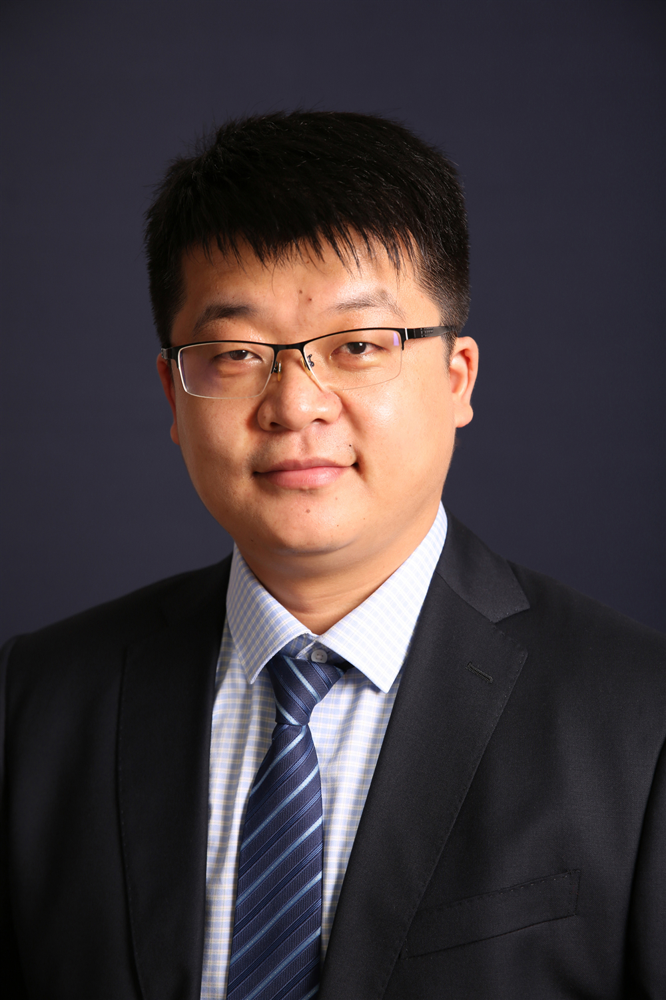

<!-- AUTO-GENERATED-BY: work/generate_obsidian_profiles.py -->

<!-- TEMPLATE: D:\workspace\信息收集整理\医生画像仓库\模板\医生画像模板.md -->

# 郭若汨

## 基础信息

| 字段 | 内容 |
|---|---|
| 姓名 | 郭若汨 |
| 医院 | 中山大学附属第三医院 |
| 科室 | 放射科 |
| 职称/身份 | 主任医师、医学博士、博士研究生导师； 职务： 放射科副主任、岭南院区放射科主任、大数据与人工智能中心副主任。多次获得中山三院优秀共产党员称号，指导多名硕士研究生获得国家奖学金。 学术任职： 中国研究型医院学会肿瘤影像诊断学专委会 委员 中国研究型医院学会 磁共振专委会脑功能学组 委员 中华医学会影像技术学分会青年学组 委员 广东省医师协会放射科分会 委员 广东省医学会影像技术学分会 常务委员 广东省医学会放射防护医学分会 委员 广东省医师协会人工智能临床应用专业委员会 委员 广东省医学会放射医学分会青年学组 副主任委员 广东省医学会肿瘤影像与大数据分会分子影像学组 副组长 广东省精准医学应用学会分子影像分会 常务委员 广东省医学装备学会 放射影像分会 常务委员 广东省医师协会放射科医师分会神经学组 委员 广东省精准医学应用学会纳米医学分会 委员 广东省预防医学会肿瘤防治专业委员会 委员。 科研成果： 国家自然科学基金、广东省自然科学基金评审专家；《新医学》青年编辑；主持国家自然科学基金2项、广东省自然科学基金等省部级课题5项，以第一/通讯作者分别在 Advanced Scienc... |
| 来源链接 | [官网原文](https://www.zssy.com.cn/node/15557) |
| 采集日期 | 2026-08-10 |

## 简介/擅长

入选中山大学附属第三医院“重大人才工程培育计划”，擅长腹部、神经影像学诊断，对分子影像学、CT/MR功能成像的临床运用积累了丰富经验。

## 可包装亮点

- 主任医师、医学博士、博士研究生导师；
- 职务： 放射科副主任、岭南院区放射科主任、大数据与人工智能中心副主任。
- 多次获得中山三院优秀共产党员称号，指导多名硕士研究生获得国家奖学金。
- 学术任职： 中国研究型医院学会肿瘤影像诊断学专委会 委员 中国研究型医院学会 磁共振专委会脑功能学组 委员 中华医学会影像技术学分会青年学组 委员 广东省医师协会放射科分会 委员 广东省医学会影像技术学分会 常务委员 广东省医学会放射防护医学分会 委员 广东省医师协会人工智能临床应用专业委员会 委员 广东省医学会放射医学分会青年学组 副主任委员 广东省医学…

## 重点疾病/人群标签

- 慢性病：
- 肿瘤：肿瘤
- 生殖疾病：
- 免疫/风湿：
- 术后恢复/康复：
- 疑难重症：

## 证据摘录

> 只摘录官网公开信息中的短句或关键字段，不复制大段原文。

- 官网身份字段：主任医师、医学博士、博士研究生导师； 职务： 放射科副主任、岭南院区放射科主任、大数据与人工智能中心副主任。多次获得中山三院优秀共产党员称号，指导多名硕士研究生获得国家奖学金。 学术任职： 中国研究型医院学会肿瘤影像诊断学专委会 委员 中…
- 官网简介/擅长：入选中山大学附属第三医院“重大人才工程培育计划”，擅长腹部、神经影像学诊断，对分子影像学、CT/MR功能成像的临床运用积累了丰富经验。
- 官网亮眼经历线索：主任医师、医学博士、博士研究生导师； 职务： 放射科副主任、岭南院区放射科主任、大数据与人工智能中心副主任。 多次获得中山三院优秀共产党员称号，指导多名硕士研究生获得国家奖学金。 学术任职： 中国研究型医院学会肿瘤影像诊断学专委会 委员 中国研究型医院学会 磁共振专委会脑功能学组 委员 中华医学会影像技术学分会青年学组 委员 广东省医师协会放射科分会 委员 广东省医学会影像技术学分会 常务委员 广东省医学会放射防护医学分会 委员 广东…
- 来源链接：https://www.zssy.com.cn/node/15557

## BD 画像摘要

郭若汨医生可作为肿瘤方向的基础画像候选。后续 BD 使用应继续以官网来源和人工复核为准，不添加疗效承诺或无来源包装。

## 合规边界

- 仅使用医院官网、官方公众号、官方小程序等公开渠道。
- 不采集私人电话、私人微信、家庭住址、患者隐私或非公开排班信息。
- 不写“保证治愈”“疗效第一”“包治疑难杂症”等无法由官网证明的表述。
