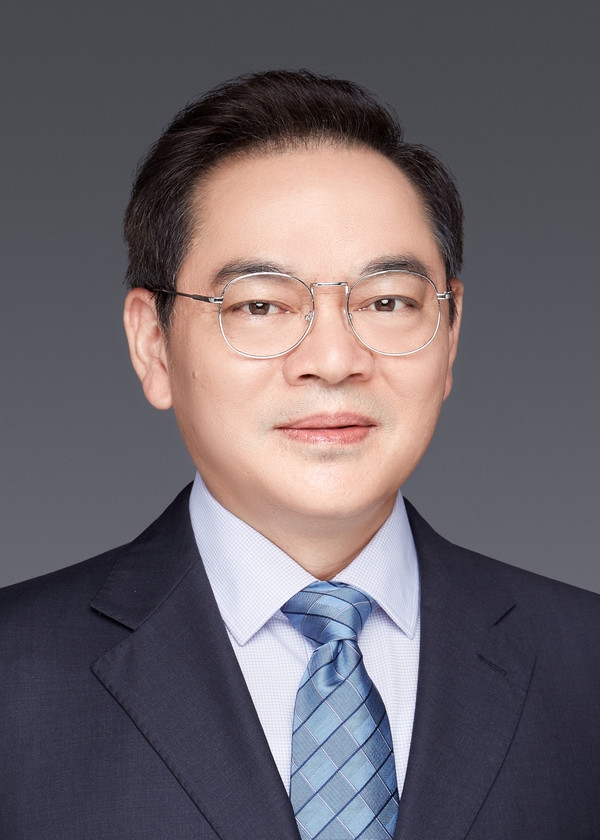

<!-- AUTO-GENERATED-BY: work/generate_obsidian_profiles.py -->

<!-- TEMPLATE: D:\workspace\信息收集整理\医生画像仓库\模板\医生画像模板.md -->

# 郭英

## 基础信息

| 字段 | 内容 |
|---|---|
| 姓名 | 郭英 |
| 医院 | 中山大学附属第三医院 |
| 科室 | 神经外科 |
| 职称/身份 | 主任医师 导师资格 博士生导师 |
| 来源链接 | [官网原文](https://www.zssy.com.cn/node/14254) |
| 采集日期 | 2026-08-10 |

## 简介/擅长

精准神经外科技术（包括临床医学、生物医学大数据、人工智能、机器人）研发和应用；神经损伤修复和再生。

## 可包装亮点

- 主任医师 导师资格 博士生导师 精准神经外科技术（包括临床医学、生物医学大数据、人工智能、机器人）研发和应用；
- 医学博士 博士生导师 教授 主任医师 ，中山大学附属第三医院神经外科学科带头人，中山大学附属第三医院神经与精神疾病中心副主任，垂体瘤诊治中心主任，中国医师协会神经内镜医师培训基地主任，中华医学会神经外科学分会第九届委员会常务委员，广东省医学会神经外科学分会主任委员，广东省医学会理事会理事，广东省医学会神经外科分会神经内镜学组组长，中国医药教育协会-神经内镜…
- 熟练掌握显微外科、神经内窥镜、颅内病变精准定位、术中神经功能监测和保护等现代微创神经外科技术，综合运用这些技术结合个体化术前手术设计成功完成各类微创神经外科手术量8000余例，并一直致力于现代微创理念和技术的推广。

## 重点疾病/人群标签

- 慢性病：
- 肿瘤：瘤
- 生殖疾病：
- 免疫/风湿：
- 术后恢复/康复：
- 疑难重症：

## 证据摘录

> 只摘录官网公开信息中的短句或关键字段，不复制大段原文。

- 官网身份字段：主任医师 导师资格 博士生导师
- 官网简介/擅长：精准神经外科技术（包括临床医学、生物医学大数据、人工智能、机器人）研发和应用；神经损伤修复和再生。
- 官网亮眼经历线索：主任医师 导师资格 博士生导师 精准神经外科技术（包括临床医学、生物医学大数据、人工智能、机器人）研发和应用； 医学博士 博士生导师 教授 主任医师 ，中山大学附属第三医院神经外科学科带头人，中山大学附属第三医院神经与精神疾病中心副主任，垂体瘤诊治中心主任，中国医师协会神经内镜医师培训基地主任，中华医学会神经外科学分会第九届委员会常务委员，广东省医学会神经外科学分会主任委员，广东省医学会理事会理事，广东省医学会神经外科分会神经内镜学组…
- 来源链接：https://www.zssy.com.cn/node/14254

## BD 画像摘要

郭英医生可作为肿瘤方向的基础画像候选。后续 BD 使用应继续以官网来源和人工复核为准，不添加疗效承诺或无来源包装。

## 合规边界

- 仅使用医院官网、官方公众号、官方小程序等公开渠道。
- 不采集私人电话、私人微信、家庭住址、患者隐私或非公开排班信息。
- 不写“保证治愈”“疗效第一”“包治疑难杂症”等无法由官网证明的表述。
