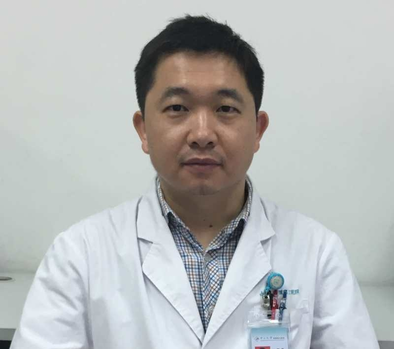

<!-- AUTO-GENERATED-BY: work/generate_obsidian_profiles.py -->

<!-- TEMPLATE: D:\workspace\信息收集整理\医生画像仓库\模板\医生画像模板.md -->

# 钟跃思

## 基础信息

| 字段 | 内容 |
|---|---|
| 姓名 | 钟跃思 |
| 医院 | 中山大学附属第三医院 |
| 科室 | 肝胆外科 |
| 职称/身份 | 主任医师 导师资格 博士生导师 |
| 来源链接 | [官网原文](https://www.zssy.com.cn/node/14116) |
| 采集日期 | 2026-08-10 |

## 简介/擅长

肝癌、胆管癌、胰腺肿瘤、胆结石、胆囊疾病、肝硬化门静脉高压症等肝胆胰脾疾病的诊治及腹腔镜微创治疗

## 可包装亮点

- 主任医师 导师资格 博士生导师 主任医师，医学博士，博士生导师。
- 广东省药学会肝胆肿瘤多学科综合治疗专家委员会常委，广东省肝胆胰外科分会青年委员，广东省抗癌协会专业委员会青年委员，广州市医学会医疗事故技术鉴定专家，日本东京大学附属病院肝胆胰外科访问学者，卫生部第35期笹川医学奖学金获得者，获得国家发明及实用新型专利4项，发表论文多篇，主持2项国家自然科学基金，2022年援藏医生。

## 重点疾病/人群标签

- 慢性病：
- 肿瘤：肿瘤、癌、肝癌、多学科
- 生殖疾病：
- 免疫/风湿：
- 术后恢复/康复：
- 疑难重症：肿瘤、癌、肝癌、多学科

## 证据摘录

> 只摘录官网公开信息中的短句或关键字段，不复制大段原文。

- 官网身份字段：主任医师 导师资格 博士生导师
- 官网简介/擅长：肝癌、胆管癌、胰腺肿瘤、胆结石、胆囊疾病、肝硬化门静脉高压症等肝胆胰脾疾病的诊治及腹腔镜微创治疗
- 官网亮眼经历线索：主任医师 导师资格 博士生导师 主任医师，医学博士，博士生导师。 广东省药学会肝胆肿瘤多学科综合治疗专家委员会常委，广东省肝胆胰外科分会青年委员，广东省抗癌协会专业委员会青年委员，广州市医学会医疗事故技术鉴定专家，日本东京大学附属病院肝胆胰外科访问学者，卫生部第35期笹川医学奖学金获得者，获得国家发明及实用新型专利4项，发表论文多篇，主持2项国家自然科学基金，2022年援藏医生。
- 来源链接：https://www.zssy.com.cn/node/14116

## BD 画像摘要

钟跃思医生可作为肿瘤、疑难重症方向的基础画像候选。后续 BD 使用应继续以官网来源和人工复核为准，不添加疗效承诺或无来源包装。

## 合规边界

- 仅使用医院官网、官方公众号、官方小程序等公开渠道。
- 不采集私人电话、私人微信、家庭住址、患者隐私或非公开排班信息。
- 不写“保证治愈”“疗效第一”“包治疑难杂症”等无法由官网证明的表述。
