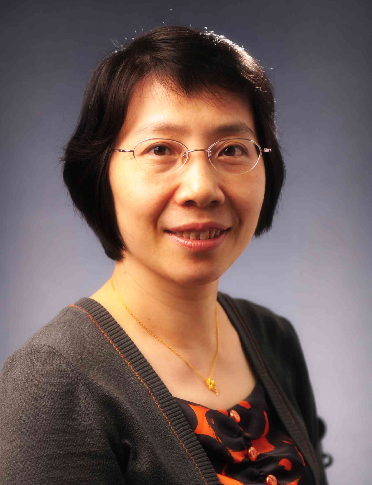

<!-- AUTO-GENERATED-BY: work/generate_obsidian_profiles.py -->

<!-- TEMPLATE: D:\workspace\信息收集整理\医生画像仓库\模板\医生画像模板.md -->

# 陈燕铭

## 基础信息

| 字段 | 内容 |
|---|---|
| 姓名 | 陈燕铭 |
| 医院 | 中山大学附属第三医院 |
| 科室 | 内分泌与代谢病学科 |
| 职称/身份 | 教授 导师资格 博士生导师 |
| 来源链接 | [官网原文](https://www.zssy.com.cn/node/11063) |
| 采集日期 | 2026-08-10 |

## 简介/擅长

糖尿病及其血管并发症、肥胖症、干细胞治疗糖尿病、甲状腺疾病等疑难重症病的临床与机制研究。作为负责人主持国家科技部重点研发计划、国家自然基金、省重点研发项目等课题10余项。发表论文80余篇，获得国家软件著作专利8项，作为第一完成人获得省科技二等奖1项、主编或参编专著4部。

## 可包装亮点

- 教授 导师资格 博士生导师 糖尿病及其血管并发症、肥胖症、干细胞治疗糖尿病、甲状腺疾病等疑难重症病的临床与机制研究。
- 作为负责人主持国家科技部重点研发计划、国家自然基金、省重点研发项目等课题10余项。
- 发表论文80余篇，获得国家软件著作专利8项，作为第一完成人获得省科技二等奖1项、主编或参编专著4部。

## 重点疾病/人群标签

- 慢性病：糖尿病、代谢、疑难、重症
- 肿瘤：
- 生殖疾病：
- 免疫/风湿：
- 术后恢复/康复：
- 疑难重症：糖尿病、代谢、疑难、重症

## 证据摘录

> 只摘录官网公开信息中的短句或关键字段，不复制大段原文。

- 官网身份字段：教授 导师资格 博士生导师
- 官网简介/擅长：糖尿病及其血管并发症、肥胖症、干细胞治疗糖尿病、甲状腺疾病等疑难重症病的临床与机制研究。作为负责人主持国家科技部重点研发计划、国家自然基金、省重点研发项目等课题10余项。发表论文80余篇，获得国家软件著作专利8项，作为第一完成人获得省科技二等奖1项、主编或参编专著4部。
- 官网亮眼经历线索：教授 导师资格 博士生导师 糖尿病及其血管并发症、肥胖症、干细胞治疗糖尿病、甲状腺疾病等疑难重症病的临床与机制研究。 作为负责人主持国家科技部重点研发计划、国家自然基金、省重点研发项目等课题10余项。 发表论文80余篇，获得国家软件著作专利8项，作为第一完成人获得省科技二等奖1项、主编或参编专著4部。
- 来源链接：https://www.zssy.com.cn/node/11063

## BD 画像摘要

陈燕铭医生可作为慢性病、疑难重症方向的基础画像候选。后续 BD 使用应继续以官网来源和人工复核为准，不添加疗效承诺或无来源包装。

## 合规边界

- 仅使用医院官网、官方公众号、官方小程序等公开渠道。
- 不采集私人电话、私人微信、家庭住址、患者隐私或非公开排班信息。
- 不写“保证治愈”“疗效第一”“包治疑难杂症”等无法由官网证明的表述。
