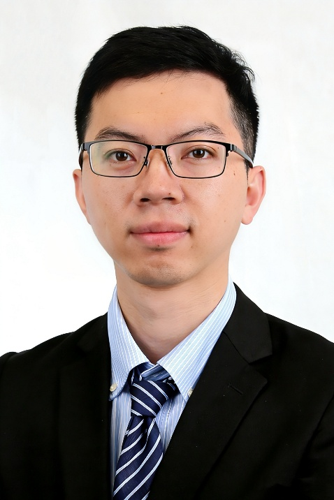

<!-- AUTO-GENERATED-BY: work/generate_obsidian_profiles.py -->

<!-- TEMPLATE: D:\workspace\信息收集整理\医生画像仓库\模板\医生画像模板.md -->

# 陈良

## 基础信息

| 字段 | 内容 |
|---|---|
| 姓名 | 陈良 |
| 医院 | 中山大学附属第三医院 |
| 科室 | 肝脏外科暨肝移植中心 |
| 职称/身份 | 副主任医师 |
| 来源链接 | [官网原文](https://www.zssy.com.cn/node/29787) |
| 采集日期 | 2026-08-10 |

## 简介/擅长

肝脏外科专家。擅长肝胆胰脾疾病的微创手术治疗，包括胆囊结石、胆囊息肉、胆囊腺肌症、胆总管结石、肝内胆管结石、肝囊肿、肝血管瘤、肝癌、胰腺良恶性肿瘤、肝硬化合并脾大等常见疾病。在肝脏恶性肿瘤的靶向、免疫治疗等方面积累了丰富的经验。

## 可包装亮点

- 副主任医师 陈良，医学博士，副主任医师，本硕博均毕业于中山大学，从事肝脏外科工作10余年。
- 任广东省医疗行业协会微创外科管理分会委员、广东省肿瘤康复学会肝癌分会常务委员。

## 重点疾病/人群标签

- 慢性病：
- 肿瘤：肿瘤、瘤、靶向、肝癌、免疫、康复
- 生殖疾病：
- 免疫/风湿：肿瘤、瘤、靶向、肝癌、免疫、康复
- 术后恢复/康复：肿瘤、瘤、靶向、肝癌、免疫、康复
- 疑难重症：

## 证据摘录

> 只摘录官网公开信息中的短句或关键字段，不复制大段原文。

- 官网身份字段：副主任医师
- 官网简介/擅长：肝脏外科专家。擅长肝胆胰脾疾病的微创手术治疗，包括胆囊结石、胆囊息肉、胆囊腺肌症、胆总管结石、肝内胆管结石、肝囊肿、肝血管瘤、肝癌、胰腺良恶性肿瘤、肝硬化合并脾大等常见疾病。在肝脏恶性肿瘤的靶向、免疫治疗等方面积累了丰富的经验。
- 官网亮眼经历线索：副主任医师 陈良，医学博士，副主任医师，本硕博均毕业于中山大学，从事肝脏外科工作10余年。 任广东省医疗行业协会微创外科管理分会委员、广东省肿瘤康复学会肝癌分会常务委员。
- 来源链接：https://www.zssy.com.cn/node/29787

## BD 画像摘要

陈良医生可作为肿瘤、免疫/风湿/感染、术后恢复/康复方向的基础画像候选。后续 BD 使用应继续以官网来源和人工复核为准，不添加疗效承诺或无来源包装。

## 合规边界

- 仅使用医院官网、官方公众号、官方小程序等公开渠道。
- 不采集私人电话、私人微信、家庭住址、患者隐私或非公开排班信息。
- 不写“保证治愈”“疗效第一”“包治疑难杂症”等无法由官网证明的表述。
