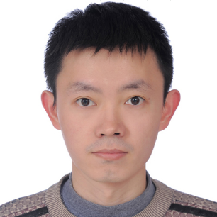

<!-- AUTO-GENERATED-BY: work/generate_obsidian_profiles.py -->

<!-- TEMPLATE: D:\workspace\信息收集整理\医生画像仓库\模板\医生画像模板.md -->

# 雎恩国

## 基础信息

| 字段 | 内容 |
|---|---|
| 姓名 | 雎恩国 |
| 医院 | 中山大学附属第三医院 |
| 科室 | 纳米医学中心 |
| 职称/身份 | 副研究员 导师资格 硕士生导师 |
| 来源链接 | [官网原文](https://www.zssy.com.cn/node/20664) |
| 采集日期 | 2026-08-10 |

## 简介/擅长

新型复合材料的制备及生物医学应用，以病毒为靶标的基因药物，智能抗癌药剂。 学术成果：在国际学术期刊以第一作者或通讯作者发表论文15篇，其中5篇发表于Angewandte Chemie-International Edition、ACS Nano、Advanced Functional Materials等影响因子大于10的国际权威期刊，3篇入选高被引论文，1篇被Materials Views China亮点报道

## 可包装亮点

- 副研究员 导师资格 硕士生导师 学术成果：在国际学术期刊以第一作者或通讯作者发表论文15篇，其中5篇发表于Angewandte Chemie-International Edition、ACS Nano、Advanced Functional Materials等影响因子大于10的国际权威期刊，3篇入选高被引论文，1篇被Materials Views Ch…

## 重点疾病/人群标签

- 慢性病：
- 肿瘤：癌
- 生殖疾病：
- 免疫/风湿：
- 术后恢复/康复：
- 疑难重症：

## 证据摘录

> 只摘录官网公开信息中的短句或关键字段，不复制大段原文。

- 官网身份字段：副研究员 导师资格 硕士生导师
- 官网简介/擅长：新型复合材料的制备及生物医学应用，以病毒为靶标的基因药物，智能抗癌药剂。 学术成果：在国际学术期刊以第一作者或通讯作者发表论文15篇，其中5篇发表于Angewandte Chemie-International Edition、ACS Nano、Advanced Functional Materials等影响因子大于10的国际权威期刊，3篇入选高被引论文，1篇被Materials Views China亮点报道
- 官网亮眼经历线索：副研究员 导师资格 硕士生导师 学术成果：在国际学术期刊以第一作者或通讯作者发表论文15篇，其中5篇发表于Angewandte Chemie-International Edition、ACS Nano、Advanced Functional Materials等影响因子大于10的国际权威期刊，3篇入选高被引论文，1篇被Materials Views China亮点报道 学术成果：在国际学术期刊以第一作者或通讯作者发表论文15篇，其中…
- 来源链接：https://www.zssy.com.cn/node/20664

## BD 画像摘要

雎恩国医生可作为肿瘤方向的基础画像候选。后续 BD 使用应继续以官网来源和人工复核为准，不添加疗效承诺或无来源包装。

## 合规边界

- 仅使用医院官网、官方公众号、官方小程序等公开渠道。
- 不采集私人电话、私人微信、家庭住址、患者隐私或非公开排班信息。
- 不写“保证治愈”“疗效第一”“包治疑难杂症”等无法由官网证明的表述。
