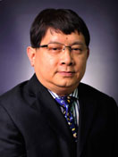

<!-- AUTO-GENERATED-BY: work/generate_obsidian_profiles.py -->

<!-- TEMPLATE: D:\workspace\信息收集整理\医生画像仓库\模板\医生画像模板.md -->

# 高新

## 基础信息

| 字段 | 内容 |
|---|---|
| 姓名 | 高新 |
| 医院 | 中山大学附属第三医院 |
| 科室 | 泌尿外科 |
| 职称/身份 | 主任医师 导师资格 博士生导师 |
| 来源链接 | [官网原文](https://www.zssy.com.cn/node/14890) |
| 采集日期 | 2026-08-10 |

## 简介/擅长

泌尿外科专家。擅长临床主治前列腺增生症和前列腺癌疾病。在国内开展首例腹腔镜下前列腺癌根治术，开展世界首例单孔经膀胱的腹腔镜前列腺癌根治术。现临床主要开展机器人前列腺根治术；荧光引导下盆腔淋巴结清扫+筋膜外前列腺根治术治疗局部晚期前列腺癌；荧光引导腹膜后淋巴结清扫治疗前列腺根治术后盆腔淋巴结复发。近年开展经尿道 1470 激光前列腺汽化剜除术，为合并心、脑、肺等内科疾病的前列腺增生病人提供安全保障。

## 可包装亮点

- 主任医师 导师资格 博士生导师 原泌尿外科学科带头人、科主任，从事泌尿外科临床工作30年。
- 医学博士，美国耶鲁大学医学院博士后；
- 中华医学会泌尿外科分会全国委员、中华医学会泌尿外科分会腔镜学组副组长、广东省泌尿外科学会主任委员；

## 重点疾病/人群标签

- 慢性病：
- 肿瘤：癌、术后
- 生殖疾病：
- 免疫/风湿：
- 术后恢复/康复：癌、术后
- 疑难重症：

## 证据摘录

> 只摘录官网公开信息中的短句或关键字段，不复制大段原文。

- 官网身份字段：主任医师 导师资格 博士生导师
- 官网简介/擅长：泌尿外科专家。擅长临床主治前列腺增生症和前列腺癌疾病。在国内开展首例腹腔镜下前列腺癌根治术，开展世界首例单孔经膀胱的腹腔镜前列腺癌根治术。现临床主要开展机器人前列腺根治术；荧光引导下盆腔淋巴结清扫+筋膜外前列腺根治术治疗局部晚期前列腺癌；荧光引导腹膜后淋巴结清扫治疗前列腺根治术后盆腔淋巴结复发。近年开展经尿道 1470 激光前列腺汽化剜除术，为合并心、脑、肺等内科疾病的前列腺增生病人提供安全保障。
- 官网亮眼经历线索：主任医师 导师资格 博士生导师 原泌尿外科学科带头人、科主任，从事泌尿外科临床工作30年。 医学博士，美国耶鲁大学医学院博士后； 中华医学会泌尿外科分会全国委员、中华医学会泌尿外科分会腔镜学组副组长、广东省泌尿外科学会主任委员；
- 来源链接：https://www.zssy.com.cn/node/14890

## BD 画像摘要

高新医生可作为肿瘤、术后恢复/康复方向的基础画像候选。后续 BD 使用应继续以官网来源和人工复核为准，不添加疗效承诺或无来源包装。

## 合规边界

- 仅使用医院官网、官方公众号、官方小程序等公开渠道。
- 不采集私人电话、私人微信、家庭住址、患者隐私或非公开排班信息。
- 不写“保证治愈”“疗效第一”“包治疑难杂症”等无法由官网证明的表述。
