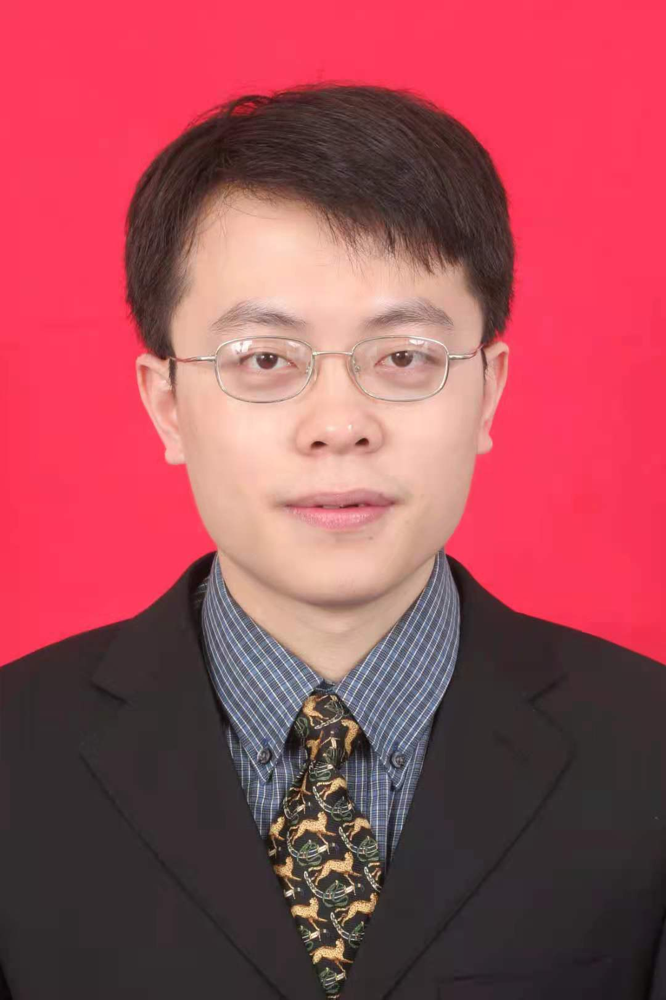

<!-- AUTO-GENERATED-BY: work/generate_obsidian_profiles.py -->

<!-- TEMPLATE: D:\workspace\信息收集整理\医生画像仓库\模板\医生画像模板.md -->

# 黄江龙

## 基础信息

| 字段 | 内容 |
|---|---|
| 姓名 | 黄江龙 |
| 医院 | 中山大学附属第三医院 |
| 科室 | 胃肠外科 |
| 职称/身份 | 副主任医师 |
| 来源链接 | [官网原文](https://www.zssy.com.cn/node/15310) |
| 采集日期 | 2026-08-10 |

## 简介/擅长

擅长胃肠道良性疾病及恶性肿瘤的诊断治疗，尤其擅长胃肠道恶性肿瘤微创手术治疗及腹壁疝手术治疗。

## 可包装亮点

- 副主任医师 中国医师协会外科医师分会微创外科医师委员会委员，广东省健康管理学会胃肠病专业委员会常务委员，广东省医学会消化道肿瘤学分会委员，广东省医师协会疝和腹壁外科医师分会委员。
- 2019年，参加中国临床肿瘤学会主办的全国消化肿瘤精英论坛MDT比赛，获得亚军；
- 2019年，参加中国抗癌协会主办中国中青年医生胃外科手术大赛，获得一等奖；

## 重点疾病/人群标签

- 慢性病：
- 肿瘤：肿瘤、癌、肠癌、MDT
- 生殖疾病：
- 免疫/风湿：
- 术后恢复/康复：
- 疑难重症：肿瘤、癌、肠癌、MDT

## 证据摘录

> 只摘录官网公开信息中的短句或关键字段，不复制大段原文。

- 官网身份字段：副主任医师
- 官网简介/擅长：擅长胃肠道良性疾病及恶性肿瘤的诊断治疗，尤其擅长胃肠道恶性肿瘤微创手术治疗及腹壁疝手术治疗。
- 官网亮眼经历线索：副主任医师 中国医师协会外科医师分会微创外科医师委员会委员，广东省健康管理学会胃肠病专业委员会常务委员，广东省医学会消化道肿瘤学分会委员，广东省医师协会疝和腹壁外科医师分会委员。 2019年，参加中国临床肿瘤学会主办的全国消化肿瘤精英论坛MDT比赛，获得亚军； 2019年，参加中国抗癌协会主办中国中青年医生胃外科手术大赛，获得一等奖；
- 来源链接：https://www.zssy.com.cn/node/15310

## BD 画像摘要

黄江龙医生可作为肿瘤、疑难重症方向的基础画像候选。后续 BD 使用应继续以官网来源和人工复核为准，不添加疗效承诺或无来源包装。

## 合规边界

- 仅使用医院官网、官方公众号、官方小程序等公开渠道。
- 不采集私人电话、私人微信、家庭住址、患者隐私或非公开排班信息。
- 不写“保证治愈”“疗效第一”“包治疑难杂症”等无法由官网证明的表述。
