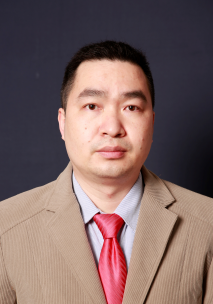

<!-- AUTO-GENERATED-BY: work/generate_obsidian_profiles.py -->

<!-- TEMPLATE: D:\workspace\信息收集整理\医生画像仓库\模板\医生画像模板.md -->

# 黄紫房

## 基础信息

| 字段 | 内容 |
|---|---|
| 姓名 | 黄紫房 |
| 医院 | 中山大学附属第三医院 |
| 科室 | 脊柱侧弯中心 |
| 职称/身份 | 副主任医师 导师资格 硕士生导师 |
| 来源链接 | [官网原文](https://www.zssy.com.cn/node/20687) |
| 采集日期 | 2026-08-10 |

## 简介/擅长

致力于青少年脊柱侧弯的早期防控和脊柱畸形精准安全微创矫正的临床及基础研究，精于青少年、婴幼儿、成人及重度脊柱畸形和强直性脊柱炎后凸等的外科及保守综合治疗，擅长颈椎病、腰椎间盘突出症、椎管狭窄症、脊柱肿瘤、脊柱骨折、脊柱感染等疾病的诊疗。

## 可包装亮点

- 副主任医师 导师资格 硕士生导师 致力于青少年脊柱侧弯的早期防控和脊柱畸形精准安全微创矫正的临床及基础研究，精于青少年、婴幼儿、成人及重度脊柱畸形和强直性脊柱炎后凸等的外科及保守综合治疗，擅长颈椎病、腰椎间盘突出症、椎管狭窄症、脊柱肿瘤、脊柱骨折、脊柱感染等疾病的诊疗。
- 副主任医师，医学博士，骨科博士后。
- 中国医师协会骨科医师分会小儿脊柱学组委员，广东省医疗行业协会脊柱外科管理分会秘书长，广东省医学会小儿外科分会小儿骨科学组委员，广东省青年五四奖章集体成员。

## 重点疾病/人群标签

- 慢性病：
- 肿瘤：肿瘤、感染、强直性脊柱炎
- 生殖疾病：
- 免疫/风湿：肿瘤、感染、强直性脊柱炎
- 术后恢复/康复：
- 疑难重症：

## 证据摘录

> 只摘录官网公开信息中的短句或关键字段，不复制大段原文。

- 官网身份字段：副主任医师 导师资格 硕士生导师
- 官网简介/擅长：致力于青少年脊柱侧弯的早期防控和脊柱畸形精准安全微创矫正的临床及基础研究，精于青少年、婴幼儿、成人及重度脊柱畸形和强直性脊柱炎后凸等的外科及保守综合治疗，擅长颈椎病、腰椎间盘突出症、椎管狭窄症、脊柱肿瘤、脊柱骨折、脊柱感染等疾病的诊疗。
- 官网亮眼经历线索：副主任医师 导师资格 硕士生导师 致力于青少年脊柱侧弯的早期防控和脊柱畸形精准安全微创矫正的临床及基础研究，精于青少年、婴幼儿、成人及重度脊柱畸形和强直性脊柱炎后凸等的外科及保守综合治疗，擅长颈椎病、腰椎间盘突出症、椎管狭窄症、脊柱肿瘤、脊柱骨折、脊柱感染等疾病的诊疗。 副主任医师，医学博士，骨科博士后。 中国医师协会骨科医师分会小儿脊柱学组委员，广东省医疗行业协会脊柱外科管理分会秘书长，广东省医学会小儿外科分会小儿骨科学组委员，广东…
- 来源链接：https://www.zssy.com.cn/node/20687

## BD 画像摘要

黄紫房医生可作为肿瘤、免疫/风湿/感染方向的基础画像候选。后续 BD 使用应继续以官网来源和人工复核为准，不添加疗效承诺或无来源包装。

## 合规边界

- 仅使用医院官网、官方公众号、官方小程序等公开渠道。
- 不采集私人电话、私人微信、家庭住址、患者隐私或非公开排班信息。
- 不写“保证治愈”“疗效第一”“包治疑难杂症”等无法由官网证明的表述。
