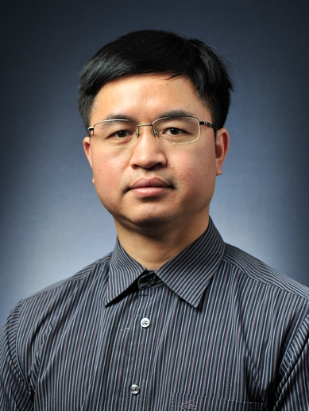

<!-- AUTO-GENERATED-BY: work/generate_obsidian_profiles.py -->

<!-- TEMPLATE: D:\workspace\信息收集整理\医生画像仓库\模板\医生画像模板.md -->

# 黎尚荣

## 基础信息

| 字段 | 内容 |
|---|---|
| 姓名 | 黎尚荣 |
| 医院 | 中山大学附属第三医院 |
| 科室 | 手术麻醉中心 |
| 职称/身份 | 主任医师 导师资格 博士生导师 |
| 来源链接 | [官网原文](https://www.zssy.com.cn/node/11287) |
| 采集日期 | 2026-08-10 |

## 简介/擅长

擅长危重症患者的救治及各种急、慢性疼痛的诊疗，如头痛、颈肩腰腿痛、神经性疼痛等，尤其在癌痛诊疗方面积累了丰富的经验。从事临床麻醉及疼痛诊疗工作20余年，具有丰富的临床经验。

## 可包装亮点

- 主任医师 导师资格 博士生导师 擅长危重症患者的救治及各种急、慢性疼痛的诊疗，如头痛、颈肩腰腿痛、神经性疼痛等，尤其在癌痛诊疗方面积累了丰富的经验。
- 麻醉科副主任，广东省疼痛学会常务委员，广东省生物医学工程学会麻醉技术专业委员会副主任委员，2007年曾作为访问学者赴美国杜克大学交流学习。
- 在国内外核心期刊发表论文40余篇，包括高水平英文论文2篇。

## 重点疾病/人群标签

- 慢性病：慢性、癌、疼痛、危重
- 肿瘤：慢性、癌、疼痛、危重
- 生殖疾病：
- 免疫/风湿：
- 术后恢复/康复：慢性、癌、疼痛、危重
- 疑难重症：慢性、癌、疼痛、危重

## 证据摘录

> 只摘录官网公开信息中的短句或关键字段，不复制大段原文。

- 官网身份字段：主任医师 导师资格 博士生导师
- 官网简介/擅长：擅长危重症患者的救治及各种急、慢性疼痛的诊疗，如头痛、颈肩腰腿痛、神经性疼痛等，尤其在癌痛诊疗方面积累了丰富的经验。从事临床麻醉及疼痛诊疗工作20余年，具有丰富的临床经验。
- 官网亮眼经历线索：主任医师 导师资格 博士生导师 擅长危重症患者的救治及各种急、慢性疼痛的诊疗，如头痛、颈肩腰腿痛、神经性疼痛等，尤其在癌痛诊疗方面积累了丰富的经验。 麻醉科副主任，广东省疼痛学会常务委员，广东省生物医学工程学会麻醉技术专业委员会副主任委员，2007年曾作为访问学者赴美国杜克大学交流学习。 在国内外核心期刊发表论文40余篇，包括高水平英文论文2篇。
- 来源链接：https://www.zssy.com.cn/node/11287

## BD 画像摘要

黎尚荣医生可作为慢性病、肿瘤、术后恢复/康复、疑难重症方向的基础画像候选。后续 BD 使用应继续以官网来源和人工复核为准，不添加疗效承诺或无来源包装。

## 合规边界

- 仅使用医院官网、官方公众号、官方小程序等公开渠道。
- 不采集私人电话、私人微信、家庭住址、患者隐私或非公开排班信息。
- 不写“保证治愈”“疗效第一”“包治疑难杂症”等无法由官网证明的表述。
