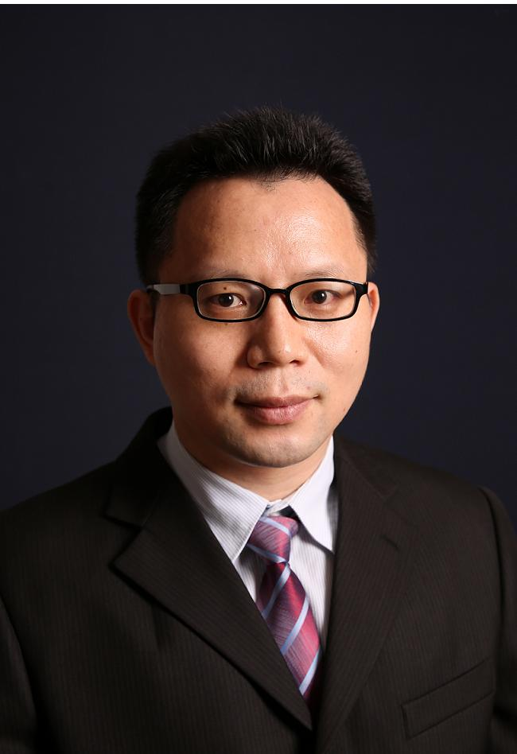

<!-- AUTO-GENERATED-BY: work/generate_obsidian_profiles.py -->

<!-- TEMPLATE: D:\workspace\信息收集整理\医生画像仓库\模板\医生画像模板.md -->

# 齐涛

## 基础信息

| 字段 | 内容 |
|---|---|
| 姓名 | 齐涛 |
| 医院 | 中山大学附属第三医院 |
| 科室 | 不育与性医学科 |
| 职称/身份 | 副主任医师 导师资格 硕士生导师 |
| 来源链接 | [官网原文](https://www.zssy.com.cn/node/28381) |
| 采集日期 | 2026-08-10 |

## 简介/擅长

性功能物理及训练等综合康复，阴茎整形术 、阴茎背深静脉包埋/结扎术、阴茎人工海绵体植入术、精索静脉腹腔镜/显微结扎术、梗阻性无精症显微复通手术。

## 可包装亮点

- 副主任医师 导师资格 硕士生导师 广东省医学会性医学分会常委 、国际性学会会员。
- 发表中文/SCI论著十余篇。

## 重点疾病/人群标签

- 慢性病：
- 肿瘤：
- 生殖疾病：
- 免疫/风湿：
- 术后恢复/康复：康复
- 疑难重症：

## 证据摘录

> 只摘录官网公开信息中的短句或关键字段，不复制大段原文。

- 官网身份字段：副主任医师 导师资格 硕士生导师
- 官网简介/擅长：性功能物理及训练等综合康复，阴茎整形术 、阴茎背深静脉包埋/结扎术、阴茎人工海绵体植入术、精索静脉腹腔镜/显微结扎术、梗阻性无精症显微复通手术。
- 官网亮眼经历线索：副主任医师 导师资格 硕士生导师 广东省医学会性医学分会常委 、国际性学会会员。 发表中文/SCI论著十余篇。
- 来源链接：https://www.zssy.com.cn/node/28381

## BD 画像摘要

齐涛医生可作为术后恢复/康复方向的基础画像候选。后续 BD 使用应继续以官网来源和人工复核为准，不添加疗效承诺或无来源包装。

## 合规边界

- 仅使用医院官网、官方公众号、官方小程序等公开渠道。
- 不采集私人电话、私人微信、家庭住址、患者隐私或非公开排班信息。
- 不写“保证治愈”“疗效第一”“包治疑难杂症”等无法由官网证明的表述。
