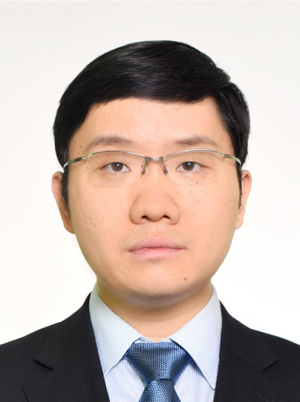

# 严彦

## 基础信息

| 字段 | 内容 |
|---|---|
| 姓名 | 严彦 |
| 医院 | 中山大学附属第五医院 |
| 科室 | 分子影像中心 |
| 职称/身份 | 中心实验室主任，副研究员，博师生导师 |
| 重点优先级 | 高 |
| 来源链接 | https://www.sysu5.cn/medical-service/department-expert/doctor/10858 |
| 采集日期 | 2026-08-08 |

## 简介/擅长

严彦医生来自中山大学附属第五医院分子影像中心，官网公开资料显示其诊疗线索与肿瘤、免疫/风湿/感染相关。
官网擅长线索：研究方向： 1. 肿瘤、感染性、炎症性疾病的相关信号通路；

## 可包装亮点

- 主持中山大学“百人计划”二期引进人才启动项目1项，在研新加坡卫生部和教育部转化医学研究课题4项，参与广州市产学研协同创新重大专项民生科技研究1项。
- 近5年来，发表高水平论文21篇，其中以第一作者、共同第一作者发表10篇，其中包括：J Allergy Clin Immunol (2篇)、J Infect Dis、Virology（2篇）、Exp Cell Res、Lab Chip、PL…

## 重点疾病/人群标签

- 慢性病：
- 肿瘤：肿瘤、瘤
- 生殖疾病：
- 免疫/风湿：免疫、感染
- 术后恢复/康复：
- 疑难重症：

## 证据摘录

> 以下只保留官网公开信息中的短句或关键字段，不复制大段原文。

- 官网身份字段：中心实验室主任，副研究员，博师生导师
- 官网擅长线索：研究方向： 1. 肿瘤、感染性、炎症性疾病的相关信号通路；
- 官网经历线索：主持中山大学“百人计划”二期引进人才启动项目1项，在研新加坡卫生部和教育部转化医学研究课题4项，参与广州市产学研协同创新重大专项民生科技研究1项。 近5年来，发表高水平论文21篇，其中以第一作者、共同第一作者发表10篇，其中包括：J Allergy Clin Immunol (2篇)、J Infect Dis、Vir…
- 来源链接：https://www.sysu5.cn/medical-service/department-expert/doctor/10858

## BD 画像摘要

严彦医生可作为肿瘤、免疫/风湿/感染方向的医生画像候选。后续 BD 包装应围绕官网已展示的科室、职称、擅长和经历线索展开，保持待人工复核状态，不添加疗效承诺。

## 合规边界

- 本条画像仅基于医院官网公开医生详情页整理。
- 未采集私人联系方式、患者案例、非公开排班或第三方评价。
- 所有亮点均需保留来源链接，不得改写为治疗效果承诺。
