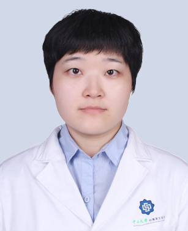

# 于雅洁

## 基础信息

| 字段 | 内容 |
|---|---|
| 姓名 | 于雅洁 |
| 医院 | 中山大学附属第五医院 |
| 科室 | 皮肤科 |
| 职称/身份 | 医师，医学博士。 |
| 重点优先级 | 中 |
| 来源链接 | https://www.sysu5.cn/medical-service/department-expert/doctor/10765 |
| 采集日期 | 2026-08-08 |

## 简介/擅长

于雅洁医生来自中山大学附属第五医院皮肤科。
官网擅长线索：擅长：皮肤科常见病、多发病如痤疮、湿疹、过敏性皮炎、荨麻疹、银屑病、带状疱疹等疾病的诊治。

## 可包装亮点

- 发表高水平论著1篇、中文核心期刊文章2篇。
- 目前任职广东省医师协会分会第四届皮肤科医师分会青年皮肤医师专业组成员、广东省中西医结合学会皮肤性病专业委员会委员、珠海市中西医结合学会皮肤专业委员会委员、广东省老年保健协会皮肤专科分会委员。

## 重点疾病/人群标签

- 慢性病：
- 肿瘤：
- 生殖疾病：
- 免疫/风湿：
- 术后恢复/康复：
- 疑难重症：

## 证据摘录

> 以下只保留官网公开信息中的短句或关键字段，不复制大段原文。

- 官网身份字段：医师，医学博士。
- 官网擅长线索：擅长：皮肤科常见病、多发病如痤疮、湿疹、过敏性皮炎、荨麻疹、银屑病、带状疱疹等疾病的诊治。
- 官网经历线索：发表高水平论著1篇、中文核心期刊文章2篇。 目前任职广东省医师协会分会第四届皮肤科医师分会青年皮肤医师专业组成员、广东省中西医结合学会皮肤性病专业委员会委员、珠海市中西医结合学会皮肤专业委员会委员、广东省老年保健协会皮肤专科分会委员。
- 来源链接：https://www.sysu5.cn/medical-service/department-expert/doctor/10765

## BD 画像摘要

于雅洁医生可作为皮肤科基础医生数据入库。当前官网资料暂未显示与本阶段重点疾病方向的强关联，建议先保留基础画像，后续按官方资料补充复核。

## 合规边界

- 本条画像仅基于医院官网公开医生详情页整理。
- 未采集私人联系方式、患者案例、非公开排班或第三方评价。
- 所有亮点均需保留来源链接，不得改写为治疗效果承诺。
