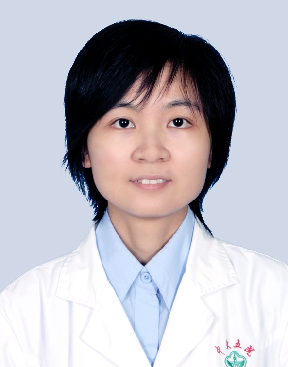

# 伍俊

## 基础信息

| 字段 | 内容 |
|---|---|
| 姓名 | 伍俊 |
| 医院 | 中山大学附属第五医院 |
| 科室 | 儿科 |
| 职称/身份 | 主治医师，医学硕士。 |
| 重点优先级 | 高 |
| 来源链接 | https://www.sysu5.cn/medical-service/department-expert/doctor/10161 |
| 采集日期 | 2026-08-08 |

## 简介/擅长

伍俊医生来自中山大学附属第五医院儿科，官网公开资料显示其诊疗线索与疑难重症相关。
官网擅长线索：中山大学儿科学硕士研究生学毕业，从事临床及儿科专业工作十余年，擅长儿科常见病、多发病的诊治，尤其对儿科危重急症的诊治具有较丰富的临床经验。

## 可包装亮点

- 中山大学儿科学硕士研究生学毕业，从事临床及儿科专业工作十余年，擅长儿科常见病、多发病的诊治，尤其对儿科危重急症的诊治具有较丰富的临床经验。
- 曾在广州市妇女儿童医疗中心儿科重症监护室（PICU）进修学习半年。
- 现任广东省女医师协会呼吸与危重症专业委员会委员，广东省基层医药学会新生儿专业委员会委员，珠海市医学会儿科分会暨首届健康教育学组委员、珠海市医学会新生儿分会委员、珠海市中西医结合学会儿科分会委员，珠海市医师协会新生儿分会委员，珠海市职工健康…

## 重点疾病/人群标签

- 慢性病：
- 肿瘤：
- 生殖疾病：
- 免疫/风湿：
- 术后恢复/康复：
- 疑难重症：危重、重症

## 证据摘录

> 以下只保留官网公开信息中的短句或关键字段，不复制大段原文。

- 官网身份字段：主治医师，医学硕士。
- 官网擅长线索：中山大学儿科学硕士研究生学毕业，从事临床及儿科专业工作十余年，擅长儿科常见病、多发病的诊治，尤其对儿科危重急症的诊治具有较丰富的临床经验。
- 官网经历线索：中山大学儿科学硕士研究生学毕业，从事临床及儿科专业工作十余年，擅长儿科常见病、多发病的诊治，尤其对儿科危重急症的诊治具有较丰富的临床经验。 曾在广州市妇女儿童医疗中心儿科重症监护室（PICU）进修学习半年。 现任广东省女医师协会呼吸与危重症专业委员会委员，广东省基层医药学会新生儿专业委员会委员，珠海市医学会儿科分会暨…
- 来源链接：https://www.sysu5.cn/medical-service/department-expert/doctor/10161

## BD 画像摘要

伍俊医生可作为疑难重症方向的医生画像候选。后续 BD 包装应围绕官网已展示的科室、职称、擅长和经历线索展开，保持待人工复核状态，不添加疗效承诺。

## 合规边界

- 本条画像仅基于医院官网公开医生详情页整理。
- 未采集私人联系方式、患者案例、非公开排班或第三方评价。
- 所有亮点均需保留来源链接，不得改写为治疗效果承诺。
