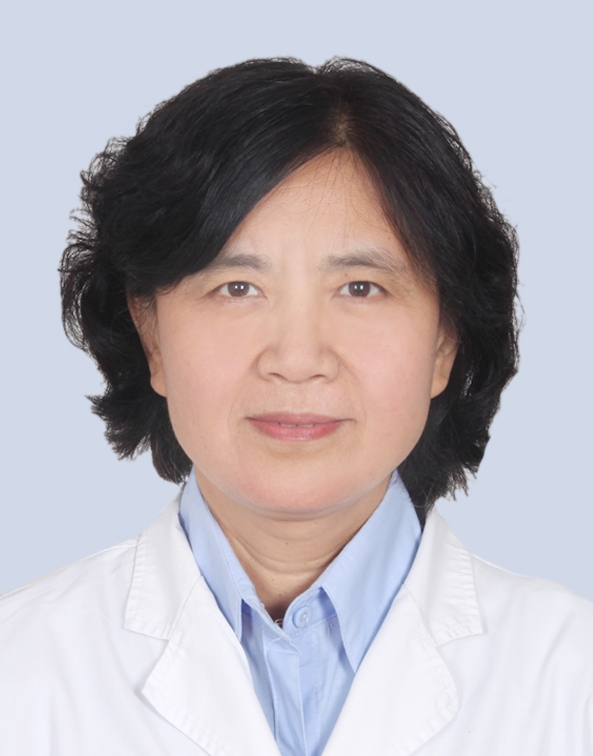

# 侯丽君

## 基础信息

| 字段 | 内容 |
|---|---|
| 姓名 | 侯丽君 |
| 医院 | 中山大学附属第五医院 |
| 科室 | 血液内科 |
| 职称/身份 | 教授，主任医师，医学博士，硕士生导师。 |
| 重点优先级 | 高 |
| 来源链接 | https://www.sysu5.cn/medical-service/department-expert/doctor/1271 |
| 采集日期 | 2026-08-08 |

## 简介/擅长

侯丽君医生来自中山大学附属第五医院血液内科，官网公开资料显示其诊疗线索与慢性病、肿瘤、免疫/风湿/感染、疑难重症相关。
官网擅长线索：擅长：各类血液病、风湿病的诊治。 具有30余年的临床工作经验，在血液、风湿疾病的诊断及治疗方面造诣颇深。 擅长各种贫血、出血性疾病、急慢性白血病、淋巴瘤、多发性骨髓瘤等血液病的诊治；

## 可包装亮点

- 教授，主任医师，医学博士，硕士生导师。
- 中山大学血液病研究所副所长、广东省健康管理学会血液学会及风湿学会副主任委员、中华医学会广东省血液学会及风湿学会常务委员。
- 曾两次留学日本，作为研修员、高级访问学者在日本仙台东北大学医学院血液免疫研究室研修。

## 重点疾病/人群标签

- 慢性病：慢性
- 肿瘤：瘤、淋巴瘤、白血病
- 生殖疾病：
- 免疫/风湿：风湿、免疫、红斑狼疮、类风湿、强直性脊柱炎
- 术后恢复/康复：
- 疑难重症：重症

## 证据摘录

> 以下只保留官网公开信息中的短句或关键字段，不复制大段原文。

- 官网身份字段：教授，主任医师，医学博士，硕士生导师。
- 官网擅长线索：擅长：各类血液病、风湿病的诊治。 具有30余年的临床工作经验，在血液、风湿疾病的诊断及治疗方面造诣颇深。 擅长各种贫血、出血性疾病、急慢性白血病、淋巴瘤、多发性骨髓瘤等血液病的诊治；
- 官网经历线索：教授，主任医师，医学博士，硕士生导师。 中山大学血液病研究所副所长、广东省健康管理学会血液学会及风湿学会副主任委员、中华医学会广东省血液学会及风湿学会常务委员。 曾两次留学日本，作为研修员、高级访问学者在日本仙台东北大学医学院血液免疫研究室研修。
- 来源链接：https://www.sysu5.cn/medical-service/department-expert/doctor/1271

## BD 画像摘要

侯丽君医生可作为慢性病、肿瘤、免疫/风湿/感染、疑难重症方向的医生画像候选。后续 BD 包装应围绕官网已展示的科室、职称、擅长和经历线索展开，保持待人工复核状态，不添加疗效承诺。

## 合规边界

- 本条画像仅基于医院官网公开医生详情页整理。
- 未采集私人联系方式、患者案例、非公开排班或第三方评价。
- 所有亮点均需保留来源链接，不得改写为治疗效果承诺。
