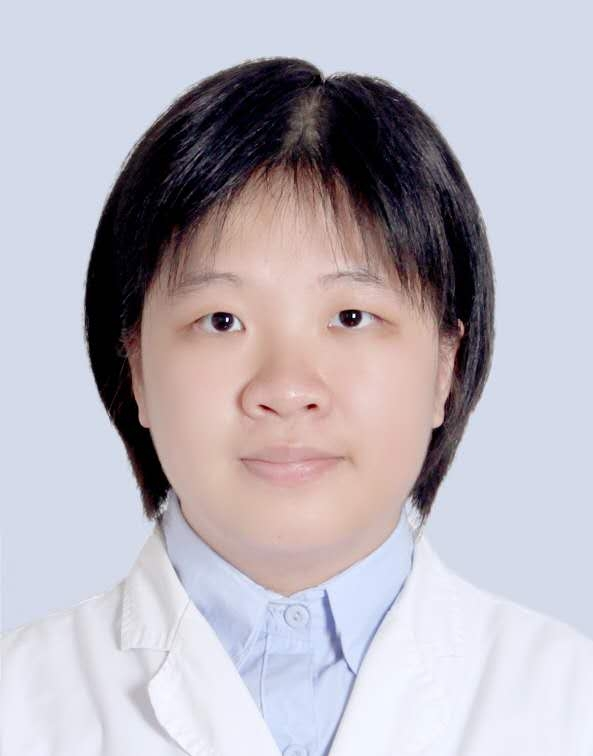

# 冯韶燕

## 基础信息

| 字段 | 内容 |
|---|---|
| 姓名 | 冯韶燕 |
| 医院 | 中山大学附属第五医院 |
| 科室 | 耳鼻咽喉&头颈外科 |
| 职称/身份 | 耳鼻咽喉头颈外科副主任，主任医师，医学博士，硕士生导师。 |
| 重点优先级 | 高 |
| 来源链接 | https://www.sysu5.cn/medical-service/department-expert/doctor/10712 |
| 采集日期 | 2026-08-08 |

## 简介/擅长

冯韶燕医生来自中山大学附属第五医院耳鼻咽喉&头颈外科，官网公开资料显示其诊疗线索与慢性病、肿瘤、疑难重症相关。
官网擅长线索：擅长显微镜和耳内镜下手术治疗各种慢性中耳炎、中耳胆脂瘤、粘连性中耳炎、耳硬化症、外伤性鼓膜穿孔、听骨链中断、先天性中外耳畸形等传导性耳聋疾病，率先在本地区开展面神经全程减压术、听神经瘤切除术、人工耳蜗植入术、颈静脉球瘤手术、颞骨恶性肿瘤切除术等高难度手术，个人年平均耳科手术量300余台，四级手术量占一半以上； 同时擅长各种疑难眩晕疾病的诊治，包括耳石症、梅尼埃病、前庭性偏头痛、前庭神经元炎等，尤其精通耳石症的手法复位治疗。

## 可包装亮点

- 耳鼻咽喉头颈外科副主任，主任医师，医学博士，硕士生导师。
- 博士毕业于中山大学中山医学院，曾到上海新华医院、中山大学附属孙逸仙纪念医院、中山三院进修学习，现已从事耳鼻咽喉-头颈外科临床专业工作20年余。
- 擅长显微镜和耳内镜下手术治疗各种慢性中耳炎、中耳胆脂瘤、粘连性中耳炎、耳硬化症、外伤性鼓膜穿孔、听骨链中断、先天性中外耳畸形等传导性耳聋疾病，率先在本地区开展面神经全程减压术、听神经瘤切除术、人工耳蜗植入术、颈静脉球瘤手术、颞骨恶性肿瘤切…

## 重点疾病/人群标签

- 慢性病：慢性
- 肿瘤：肿瘤、瘤
- 生殖疾病：
- 免疫/风湿：
- 术后恢复/康复：
- 疑难重症：疑难

## 证据摘录

> 以下只保留官网公开信息中的短句或关键字段，不复制大段原文。

- 官网身份字段：耳鼻咽喉头颈外科副主任，主任医师，医学博士，硕士生导师。
- 官网擅长线索：擅长显微镜和耳内镜下手术治疗各种慢性中耳炎、中耳胆脂瘤、粘连性中耳炎、耳硬化症、外伤性鼓膜穿孔、听骨链中断、先天性中外耳畸形等传导性耳聋疾病，率先在本地区开展面神经全程减压术、听神经瘤切除术、人工耳蜗植入术、颈静脉球瘤手术、颞骨恶性肿瘤切除术等高难度手术，个人年平均耳科手术量300余台，四级手术量占一半以上； 同时擅…
- 官网经历线索：耳鼻咽喉头颈外科副主任，主任医师，医学博士，硕士生导师。 博士毕业于中山大学中山医学院，曾到上海新华医院、中山大学附属孙逸仙纪念医院、中山三院进修学习，现已从事耳鼻咽喉-头颈外科临床专业工作20年余。 擅长显微镜和耳内镜下手术治疗各种慢性中耳炎、中耳胆脂瘤、粘连性中耳炎、耳硬化症、外伤性鼓膜穿孔、听骨链中断、先天性中…
- 来源链接：https://www.sysu5.cn/medical-service/department-expert/doctor/10712

## BD 画像摘要

冯韶燕医生可作为慢性病、肿瘤、疑难重症方向的医生画像候选。后续 BD 包装应围绕官网已展示的科室、职称、擅长和经历线索展开，保持待人工复核状态，不添加疗效承诺。

## 合规边界

- 本条画像仅基于医院官网公开医生详情页整理。
- 未采集私人联系方式、患者案例、非公开排班或第三方评价。
- 所有亮点均需保留来源链接，不得改写为治疗效果承诺。
