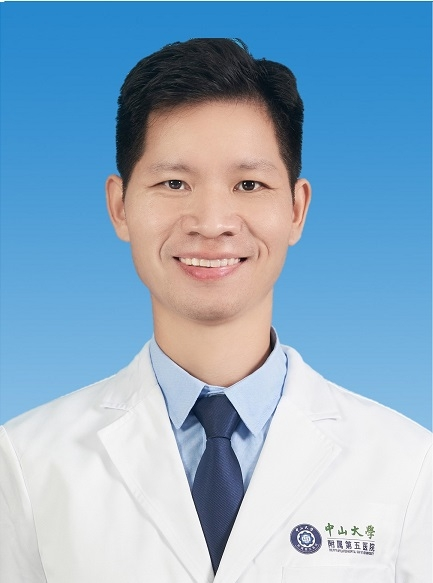

# 冼建忠

## 基础信息

| 字段 | 内容 |
|---|---|
| 姓名 | 冼建忠 |
| 医院 | 中山大学附属第五医院 |
| 科室 | 超声医学科 |
| 职称/身份 | 副主任医师，医学博士。 |
| 重点优先级 | 高 |
| 来源链接 | https://www.sysu5.cn/medical-service/department-expert/doctor/10852 |
| 采集日期 | 2026-08-08 |

## 简介/擅长

冼建忠医生来自中山大学附属第五医院超声医学科，官网公开资料显示其诊疗线索与肿瘤相关。
官网擅长线索：从事超声医学诊疗工作15年，积累较丰富临床的经验，主要从事与研究方向为浅表器官超声诊断、超声介入诊断与治疗，包括超声引导下穿刺活检、置管引流、肿瘤射频消融治疗等。

## 可包装亮点

- 副主任医师，医学博士。
- 2008年于中山大学中山医学院毕业后就职于中山大学附属第五医院超声科至今，2022年获得中山大学医学博士学位，现为超声科副主任医师。
- 现任广东省医师协会超声分会浅表组委员、广东省健康管理协会超声分会委员、珠海市医学会超声分会委员、珠海市医师协会甲状腺外科分会委员等。

## 重点疾病/人群标签

- 慢性病：
- 肿瘤：肿瘤、瘤
- 生殖疾病：
- 免疫/风湿：
- 术后恢复/康复：
- 疑难重症：

## 证据摘录

> 以下只保留官网公开信息中的短句或关键字段，不复制大段原文。

- 官网身份字段：副主任医师，医学博士。
- 官网擅长线索：从事超声医学诊疗工作15年，积累较丰富临床的经验，主要从事与研究方向为浅表器官超声诊断、超声介入诊断与治疗，包括超声引导下穿刺活检、置管引流、肿瘤射频消融治疗等。
- 官网经历线索：副主任医师，医学博士。 2008年于中山大学中山医学院毕业后就职于中山大学附属第五医院超声科至今，2022年获得中山大学医学博士学位，现为超声科副主任医师。 现任广东省医师协会超声分会浅表组委员、广东省健康管理协会超声分会委员、珠海市医学会超声分会委员、珠海市医师协会甲状腺外科分会委员等。
- 来源链接：https://www.sysu5.cn/medical-service/department-expert/doctor/10852

## BD 画像摘要

冼建忠医生可作为肿瘤方向的医生画像候选。后续 BD 包装应围绕官网已展示的科室、职称、擅长和经历线索展开，保持待人工复核状态，不添加疗效承诺。

## 合规边界

- 本条画像仅基于医院官网公开医生详情页整理。
- 未采集私人联系方式、患者案例、非公开排班或第三方评价。
- 所有亮点均需保留来源链接，不得改写为治疗效果承诺。
