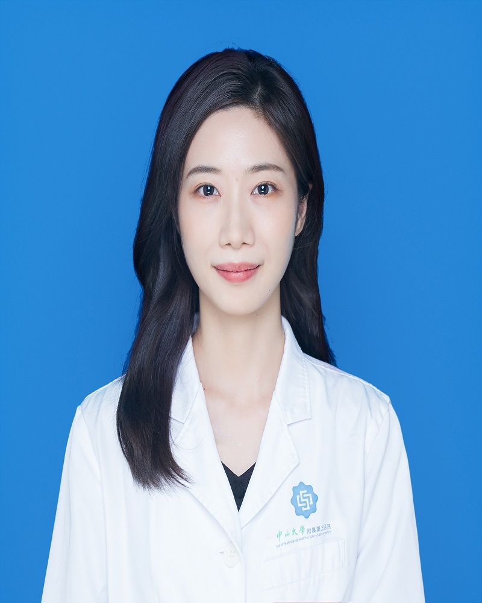

# 刘婷

## 基础信息

| 字段 | 内容 |
|---|---|
| 姓名 | 刘婷 |
| 医院 | 中山大学附属第五医院 |
| 科室 | 皮肤科 |
| 职称/身份 | 医师 |
| 重点优先级 | 中 |
| 来源链接 | https://www.sysu5.cn/medical-service/department-expert/doctor/10762 |
| 采集日期 | 2026-08-08 |

## 简介/擅长

刘婷医生来自中山大学附属第五医院皮肤科。
官网擅长线索：硕士毕业于广州中医药大学,擅长各类色斑、痤疮、炎症后色素沉着、敏感性皮肤、玫瑰痤疮、瘢 痕、痤疮瘢痕、脱发及常见皮肤疾病的诊断及治疗，尤其对激光美容具有丰富的临床经验，及PRP、肉毒注射、水光、刷酸、护肤咨询等，现任广东省医学会微整形与注射学会秘书。

## 可包装亮点

- 硕士毕业于广州中医药大学,擅长各类色斑、痤疮、炎症后色素沉着、敏感性皮肤、玫瑰痤疮、瘢 痕、痤疮瘢痕、脱发及常见皮肤疾病的诊断及治疗，尤其对激光美容具有丰富的临床经验，及PRP、肉毒注射、水光、刷酸、护肤咨询等，现任广东省医学会微整形与注…

## 重点疾病/人群标签

- 慢性病：
- 肿瘤：
- 生殖疾病：
- 免疫/风湿：
- 术后恢复/康复：
- 疑难重症：

## 证据摘录

> 以下只保留官网公开信息中的短句或关键字段，不复制大段原文。

- 官网身份字段：医师
- 官网擅长线索：硕士毕业于广州中医药大学,擅长各类色斑、痤疮、炎症后色素沉着、敏感性皮肤、玫瑰痤疮、瘢 痕、痤疮瘢痕、脱发及常见皮肤疾病的诊断及治疗，尤其对激光美容具有丰富的临床经验，及PRP、肉毒注射、水光、刷酸、护肤咨询等，现任广东省医学会微整形与注射学会秘书。
- 官网经历线索：硕士毕业于广州中医药大学,擅长各类色斑、痤疮、炎症后色素沉着、敏感性皮肤、玫瑰痤疮、瘢 痕、痤疮瘢痕、脱发及常见皮肤疾病的诊断及治疗，尤其对激光美容具有丰富的临床经验，及PRP、肉毒注射、水光、刷酸、护肤咨询等，现任广东省医学会微整形与注射学会秘书。
- 来源链接：https://www.sysu5.cn/medical-service/department-expert/doctor/10762

## BD 画像摘要

刘婷医生可作为皮肤科基础医生数据入库。当前官网资料暂未显示与本阶段重点疾病方向的强关联，建议先保留基础画像，后续按官方资料补充复核。

## 合规边界

- 本条画像仅基于医院官网公开医生详情页整理。
- 未采集私人联系方式、患者案例、非公开排班或第三方评价。
- 所有亮点均需保留来源链接，不得改写为治疗效果承诺。
