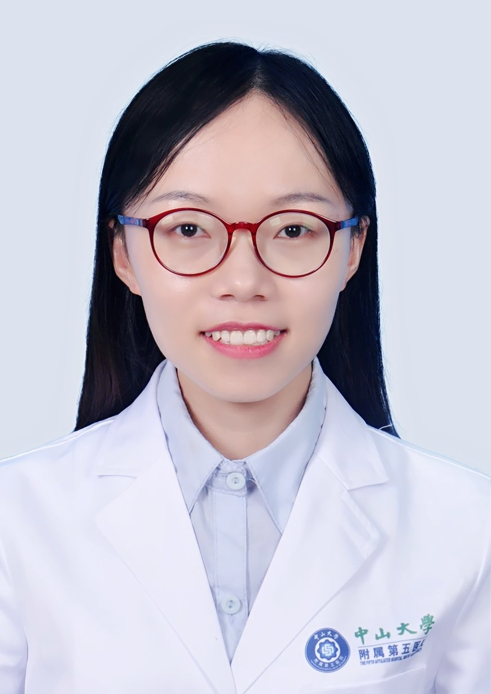

# 刘慧敏

## 基础信息

| 字段 | 内容 |
|---|---|
| 姓名 | 刘慧敏 |
| 医院 | 中山大学附属第五医院 |
| 科室 | 口腔科 |
| 职称/身份 | 医师，医字硕士 |
| 重点优先级 | 中 |
| 来源链接 | https://www.sysu5.cn/medical-service/department-expert/doctor/10746 |
| 采集日期 | 2026-08-08 |

## 简介/擅长

刘慧敏医生来自中山大学附属第五医院口腔科。
官网擅长线索：擅长龋病、非龋性疾病、牙髓病及根尖周炎等牙体牙髓疾病的诊断治疗，牙龈出血、口腔异味、牙齿松动等各种常见牙周疾病的系统治疗，和个性化针对性的口腔保健方法指导，以及牙体缺损的修复治疗。 研究方向为牙髓再生。

## 可包装亮点

- 主持校级项目1项，参与省部级重点研发项目1项，申请国家专利1项（已受理）。
- 以第一作者发表论文2篇，其中SCI 1篇。

## 重点疾病/人群标签

- 慢性病：
- 肿瘤：
- 生殖疾病：
- 免疫/风湿：
- 术后恢复/康复：
- 疑难重症：

## 证据摘录

> 以下只保留官网公开信息中的短句或关键字段，不复制大段原文。

- 官网身份字段：医师，医字硕士
- 官网擅长线索：擅长龋病、非龋性疾病、牙髓病及根尖周炎等牙体牙髓疾病的诊断治疗，牙龈出血、口腔异味、牙齿松动等各种常见牙周疾病的系统治疗，和个性化针对性的口腔保健方法指导，以及牙体缺损的修复治疗。 研究方向为牙髓再生。
- 官网经历线索：主持校级项目1项，参与省部级重点研发项目1项，申请国家专利1项（已受理）。 以第一作者发表论文2篇，其中SCI 1篇。
- 来源链接：https://www.sysu5.cn/medical-service/department-expert/doctor/10746

## BD 画像摘要

刘慧敏医生可作为口腔科基础医生数据入库。当前官网资料暂未显示与本阶段重点疾病方向的强关联，建议先保留基础画像，后续按官方资料补充复核。

## 合规边界

- 本条画像仅基于医院官网公开医生详情页整理。
- 未采集私人联系方式、患者案例、非公开排班或第三方评价。
- 所有亮点均需保留来源链接，不得改写为治疗效果承诺。
