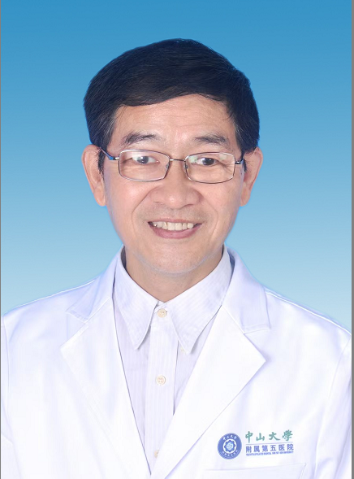

# 刘海杰

## 基础信息

| 字段 | 内容 |
|---|---|
| 姓名 | 刘海杰 |
| 医院 | 中山大学附属第五医院 |
| 科室 | 皮肤科 |
| 职称/身份 | 主任医师、医学博士 |
| 重点优先级 | 中 |
| 来源链接 | https://www.sysu5.cn/medical-service/department-expert/doctor/11677 |
| 采集日期 | 2026-08-08 |

## 简介/擅长

刘海杰医生来自中山大学附属第五医院皮肤科。
官网擅长线索：擅长中西医结合治疗脱发、斑秃、面部皮肤病、带状疱疹、白癜风、顽固性湿疹、银屑病、荨麻疹及丝状疣、扁平疣等。

## 可包装亮点

- 主任医师、医学博士 主任医师、医学博士 从事皮肤临床40余年，任广东省中医药学会经专业委员会常务理事，珠海市医学会皮肤分会委员。

## 重点疾病/人群标签

- 慢性病：
- 肿瘤：
- 生殖疾病：
- 免疫/风湿：
- 术后恢复/康复：
- 疑难重症：

## 证据摘录

> 以下只保留官网公开信息中的短句或关键字段，不复制大段原文。

- 官网身份字段：主任医师、医学博士
- 官网擅长线索：擅长中西医结合治疗脱发、斑秃、面部皮肤病、带状疱疹、白癜风、顽固性湿疹、银屑病、荨麻疹及丝状疣、扁平疣等。
- 官网经历线索：主任医师、医学博士 主任医师、医学博士 从事皮肤临床40余年，任广东省中医药学会经专业委员会常务理事，珠海市医学会皮肤分会委员。
- 来源链接：https://www.sysu5.cn/medical-service/department-expert/doctor/11677

## BD 画像摘要

刘海杰医生可作为皮肤科基础医生数据入库。当前官网资料暂未显示与本阶段重点疾病方向的强关联，建议先保留基础画像，后续按官方资料补充复核。

## 合规边界

- 本条画像仅基于医院官网公开医生详情页整理。
- 未采集私人联系方式、患者案例、非公开排班或第三方评价。
- 所有亮点均需保留来源链接，不得改写为治疗效果承诺。
