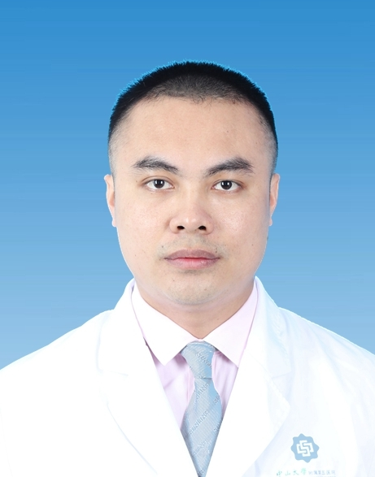

# 刘湘

## 基础信息

| 字段 | 内容 |
|---|---|
| 姓名 | 刘湘 |
| 医院 | 中山大学附属第五医院 |
| 科室 | 脊柱外科 |
| 职称/身份 | 主治医师，医学硕士。 |
| 重点优先级 | 高 |
| 来源链接 | https://www.sysu5.cn/medical-service/department-expert/doctor/8167 |
| 采集日期 | 2026-08-08 |

## 简介/擅长

刘湘医生来自中山大学附属第五医院脊柱外科，官网公开资料显示其诊疗线索与术后恢复/康复相关。
官网擅长线索：主攻研究方向为颈痛、腰痛疾病，擅长腰椎间盘突出、腰椎骨折、腰椎滑脱、骨质疏松症、下肢疼痛麻木、颈椎病等脊柱疾病的微创治疗。

## 可包装亮点

- 曾任北美脊柱外科协会会员,现任广东省健康管理委员会脊柱创伤学组委员、珠海市医师协会疼痛分会委员、珠海市医师协会数字骨科分会委员，发表高水平论文近20篇，其中第一作者发表在《Spine》杂志2篇，参与《Spine》杂志审稿20余篇。
- 先后受邀在中华医学会骨科年会COA（北京）、全国脊柱脊髓年会（广州）、世界骨科会议（加拿大）、亚太脊椎医学会年会（中国台湾）、世界脊柱学术高峰会（中国香港）等会议学术发言。

## 重点疾病/人群标签

- 慢性病：
- 肿瘤：
- 生殖疾病：
- 免疫/风湿：
- 术后恢复/康复：疼痛
- 疑难重症：

## 证据摘录

> 以下只保留官网公开信息中的短句或关键字段，不复制大段原文。

- 官网身份字段：主治医师，医学硕士。
- 官网擅长线索：主攻研究方向为颈痛、腰痛疾病，擅长腰椎间盘突出、腰椎骨折、腰椎滑脱、骨质疏松症、下肢疼痛麻木、颈椎病等脊柱疾病的微创治疗。
- 官网经历线索：曾任北美脊柱外科协会会员,现任广东省健康管理委员会脊柱创伤学组委员、珠海市医师协会疼痛分会委员、珠海市医师协会数字骨科分会委员，发表高水平论文近20篇，其中第一作者发表在《Spine》杂志2篇，参与《Spine》杂志审稿20余篇。 先后受邀在中华医学会骨科年会COA（北京）、全国脊柱脊髓年会（广州）、世界骨科会议（加…
- 来源链接：https://www.sysu5.cn/medical-service/department-expert/doctor/8167

## BD 画像摘要

刘湘医生可作为术后恢复/康复方向的医生画像候选。后续 BD 包装应围绕官网已展示的科室、职称、擅长和经历线索展开，保持待人工复核状态，不添加疗效承诺。

## 合规边界

- 本条画像仅基于医院官网公开医生详情页整理。
- 未采集私人联系方式、患者案例、非公开排班或第三方评价。
- 所有亮点均需保留来源链接，不得改写为治疗效果承诺。
