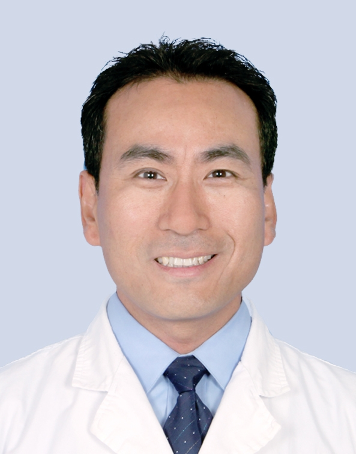

# 卫金歧

## 基础信息

| 字段 | 内容 |
|---|---|
| 姓名 | 卫金歧 |
| 医院 | 中山大学附属第五医院 |
| 科室 | 消化内科 |
| 职称/身份 | 主任医师，医学硕士，硕士生导师。 |
| 重点优先级 | 高 |
| 来源链接 | https://www.sysu5.cn/medical-service/department-expert/doctor/850 |
| 采集日期 | 2026-08-08 |

## 简介/擅长

卫金歧医生来自中山大学附属第五医院消化内科，官网公开资料显示其诊疗线索与肿瘤、疑难重症相关。
官网擅长线索：曾多次参加国内外消化系病及消化内镜学术会议。 从事消化专业工作33年，擅长消化系疾病的诊治，尤其对幽门螺杆菌相关疾病、功能性胃食管疾病、炎症性肠病、良恶性腹水、消化道早癌或癌前病变（肠化生、上皮内瘤变、息肉）内镜下切除，消化道良恶性狭窄扩张及支架置入、消化道出血内镜下各种方法治疗、胰胆道疾病ERCP微创诊治具有丰富的临床经验，现任广东省医学会消化病分会委员职务。

## 可包装亮点

- 主任医师，医学硕士，硕士生导师。
- 从事消化专业工作33年，擅长消化系疾病的诊治，尤其对幽门螺杆菌相关疾病、功能性胃食管疾病、炎症性肠病、良恶性腹水、消化道早癌或癌前病变（肠化生、上皮内瘤变、息肉）内镜下切除，消化道良恶性狭窄扩张及支架置入、消化道出血内镜下各种方法治疗、胰…

## 重点疾病/人群标签

- 慢性病：
- 肿瘤：癌、瘤
- 生殖疾病：
- 免疫/风湿：
- 术后恢复/康复：
- 疑难重症：高危

## 证据摘录

> 以下只保留官网公开信息中的短句或关键字段，不复制大段原文。

- 官网身份字段：主任医师，医学硕士，硕士生导师。
- 官网擅长线索：曾多次参加国内外消化系病及消化内镜学术会议。 从事消化专业工作33年，擅长消化系疾病的诊治，尤其对幽门螺杆菌相关疾病、功能性胃食管疾病、炎症性肠病、良恶性腹水、消化道早癌或癌前病变（肠化生、上皮内瘤变、息肉）内镜下切除，消化道良恶性狭窄扩张及支架置入、消化道出血内镜下各种方法治疗、胰胆道疾病ERCP微创诊治具有丰富的…
- 官网经历线索：主任医师，医学硕士，硕士生导师。 从事消化专业工作33年，擅长消化系疾病的诊治，尤其对幽门螺杆菌相关疾病、功能性胃食管疾病、炎症性肠病、良恶性腹水、消化道早癌或癌前病变（肠化生、上皮内瘤变、息肉）内镜下切除，消化道良恶性狭窄扩张及支架置入、消化道出血内镜下各种方法治疗、胰胆道疾病ERCP微创诊治具有丰富的临床经… 在…
- 来源链接：https://www.sysu5.cn/medical-service/department-expert/doctor/850

## BD 画像摘要

卫金歧医生可作为肿瘤、疑难重症方向的医生画像候选。后续 BD 包装应围绕官网已展示的科室、职称、擅长和经历线索展开，保持待人工复核状态，不添加疗效承诺。

## 合规边界

- 本条画像仅基于医院官网公开医生详情页整理。
- 未采集私人联系方式、患者案例、非公开排班或第三方评价。
- 所有亮点均需保留来源链接，不得改写为治疗效果承诺。
