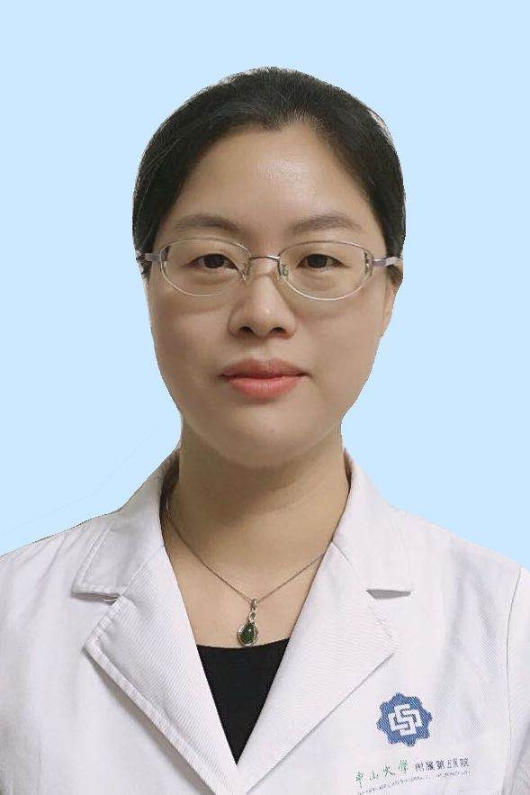

# 吕明慧

## 基础信息

| 字段 | 内容 |
|---|---|
| 姓名 | 吕明慧 |
| 医院 | 中山大学附属第五医院 |
| 科室 | 耳鼻咽喉&头颈外科 |
| 职称/身份 | 主治医师，医学硕士。 |
| 重点优先级 | 中 |
| 来源链接 | https://www.sysu5.cn/medical-service/department-expert/doctor/10716 |
| 采集日期 | 2026-08-08 |

## 简介/擅长

吕明慧医生来自中山大学附属第五医院耳鼻咽喉&头颈外科。
官网擅长线索：2013年前往中山一院耳鼻咽喉科进修鼾症的诊断及个体化治疗，广东省人民医院进修嗓音医学。 从事耳咽喉专业工作17年余，熟练掌握耳鼻咽喉科各亚专业常见病及多发病的诊治。 2013起主诊方向为鼾症及嗓音障碍疾病的诊治。 对成人/儿童鼾症及各类嗓音疾病的病因、诊断、治疗方案有系统的理论认识和诊治心得；

## 可包装亮点

- 2013年前往中山一院耳鼻咽喉科进修鼾症的诊断及个体化治疗，广东省人民医院进修嗓音医学。
- 现任广东省中西医结合学会嗓音分会委员，科室的嗓音训练已成为珠海地区的特色治疗。
- 以第一作者或通讯作者在国内外期刊发表论文4篇。

## 重点疾病/人群标签

- 慢性病：
- 肿瘤：
- 生殖疾病：
- 免疫/风湿：
- 术后恢复/康复：
- 疑难重症：

## 证据摘录

> 以下只保留官网公开信息中的短句或关键字段，不复制大段原文。

- 官网身份字段：主治医师，医学硕士。
- 官网擅长线索：2013年前往中山一院耳鼻咽喉科进修鼾症的诊断及个体化治疗，广东省人民医院进修嗓音医学。 从事耳咽喉专业工作17年余，熟练掌握耳鼻咽喉科各亚专业常见病及多发病的诊治。 2013起主诊方向为鼾症及嗓音障碍疾病的诊治。 对成人/儿童鼾症及各类嗓音疾病的病因、诊断、治疗方案有系统的理论认识和诊治心得；
- 官网经历线索：2013年前往中山一院耳鼻咽喉科进修鼾症的诊断及个体化治疗，广东省人民医院进修嗓音医学。 现任广东省中西医结合学会嗓音分会委员，科室的嗓音训练已成为珠海地区的特色治疗。 以第一作者或通讯作者在国内外期刊发表论文4篇。
- 来源链接：https://www.sysu5.cn/medical-service/department-expert/doctor/10716

## BD 画像摘要

吕明慧医生可作为耳鼻咽喉&头颈外科基础医生数据入库。当前官网资料暂未显示与本阶段重点疾病方向的强关联，建议先保留基础画像，后续按官方资料补充复核。

## 合规边界

- 本条画像仅基于医院官网公开医生详情页整理。
- 未采集私人联系方式、患者案例、非公开排班或第三方评价。
- 所有亮点均需保留来源链接，不得改写为治疗效果承诺。
