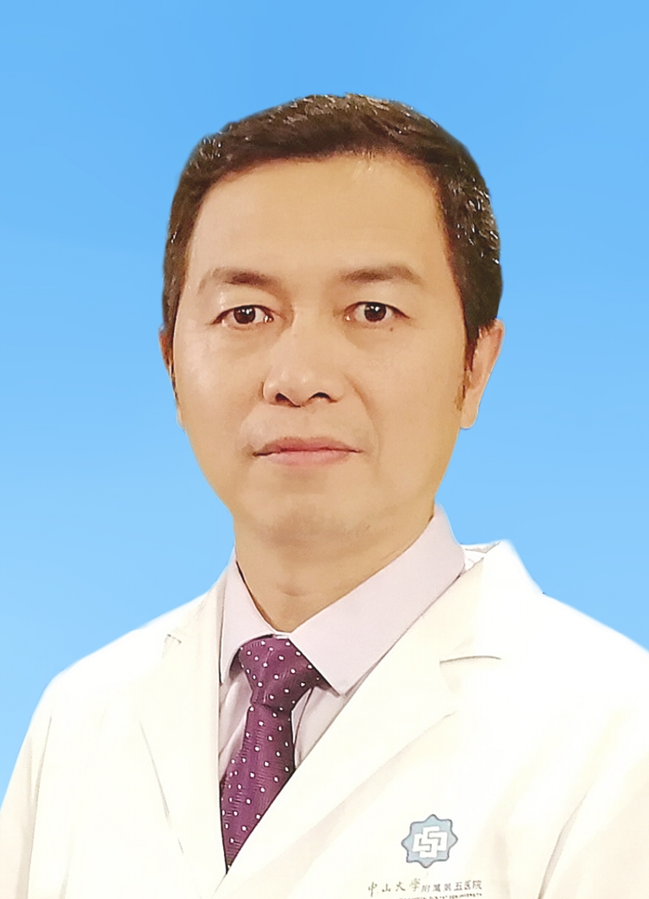

# 吕海

## 基础信息

| 字段 | 内容 |
|---|---|
| 姓名 | 吕海 |
| 医院 | 中山大学附属第五医院 |
| 科室 | 脊柱外科 |
| 职称/身份 | 脊柱外科主任，主任医师，医学博士，博士后，博士生导师。 |
| 重点优先级 | 高 |
| 来源链接 | https://www.sysu5.cn/medical-service/department-expert/doctor/8140 |
| 采集日期 | 2026-08-08 |

## 简介/擅长

吕海医生来自中山大学附属第五医院脊柱外科，官网公开资料显示其诊疗线索与肿瘤、术后恢复/康复、疑难重症相关。
官网擅长线索：擅长颈肩痛、腰腿痛、椎间盘突出、椎管狭窄、脊柱外伤、脊柱畸形、头痛头晕、骨与软组织肿瘤等疾病的微创及常规手术治疗，尤其对脊柱微创手术、高难度复杂手术具有丰富临床经验。 现为国际SICOT学会委员，国家自然科学基金评审专家，中华中医药学会经皮脊柱内镜学组常委、广东省医学教育学会骨科分会副主委、广东省康复医学会微创脊柱外科专业委员会副主委、珠海市医师协会疼痛专业委员会主委。

## 可包装亮点

- 脊柱外科主任，主任医师，医学博士，博士后，博士生导师。
- 曾前往美国约翰霍普金斯大学、马里兰大学临床中心、巴尔的摩Sinai医院、Good Samaritan医院、美国特种外科医院、安德森骨科研究中心、UCSF医学院、美国NIH马格努森临床中心、德国圣安娜医院研究、学习。
- 现为国际SICOT学会委员，国家自然科学基金评审专家，中华中医药学会经皮脊柱内镜学组常委、广东省医学教育学会骨科分会副主委、广东省康复医学会微创脊柱外科专业委员会副主委、珠海市医师协会疼痛专业委员会主委。

## 重点疾病/人群标签

- 慢性病：
- 肿瘤：肿瘤、瘤
- 生殖疾病：
- 免疫/风湿：
- 术后恢复/康复：康复、疼痛
- 疑难重症：复杂

## 证据摘录

> 以下只保留官网公开信息中的短句或关键字段，不复制大段原文。

- 官网身份字段：脊柱外科主任，主任医师，医学博士，博士后，博士生导师。
- 官网擅长线索：擅长颈肩痛、腰腿痛、椎间盘突出、椎管狭窄、脊柱外伤、脊柱畸形、头痛头晕、骨与软组织肿瘤等疾病的微创及常规手术治疗，尤其对脊柱微创手术、高难度复杂手术具有丰富临床经验。 现为国际SICOT学会委员，国家自然科学基金评审专家，中华中医药学会经皮脊柱内镜学组常委、广东省医学教育学会骨科分会副主委、广东省康复医学会微创脊柱外…
- 官网经历线索：脊柱外科主任，主任医师，医学博士，博士后，博士生导师。 曾前往美国约翰霍普金斯大学、马里兰大学临床中心、巴尔的摩Sinai医院、Good Samaritan医院、美国特种外科医院、安德森骨科研究中心、UCSF医学院、美国NIH马格努森临床中心、德国圣安娜医院研究、学习。 现为国际SICOT学会委员，国家自然科学基金评…
- 来源链接：https://www.sysu5.cn/medical-service/department-expert/doctor/8140

## BD 画像摘要

吕海医生可作为肿瘤、术后恢复/康复、疑难重症方向的医生画像候选。后续 BD 包装应围绕官网已展示的科室、职称、擅长和经历线索展开，保持待人工复核状态，不添加疗效承诺。

## 合规边界

- 本条画像仅基于医院官网公开医生详情页整理。
- 未采集私人联系方式、患者案例、非公开排班或第三方评价。
- 所有亮点均需保留来源链接，不得改写为治疗效果承诺。
